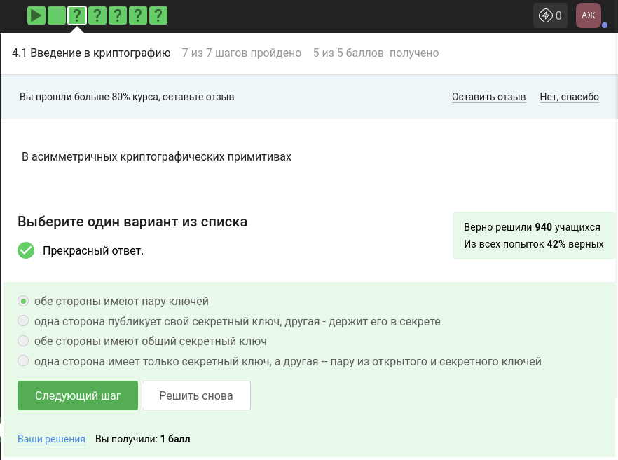
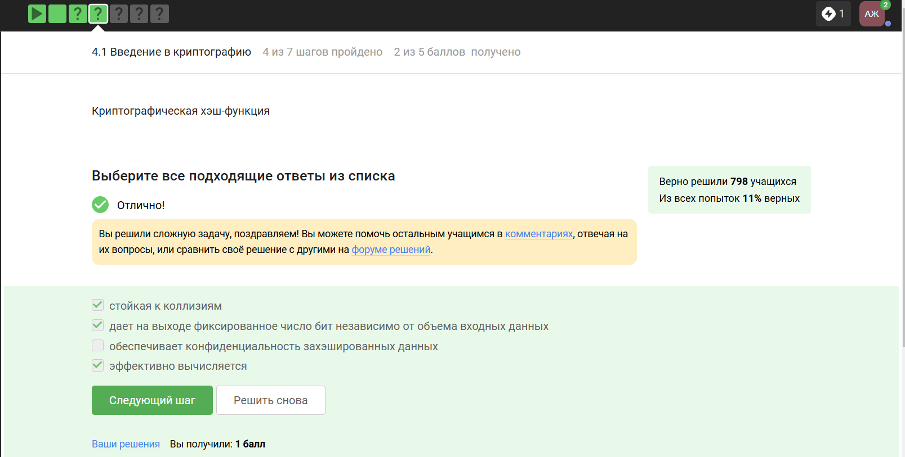
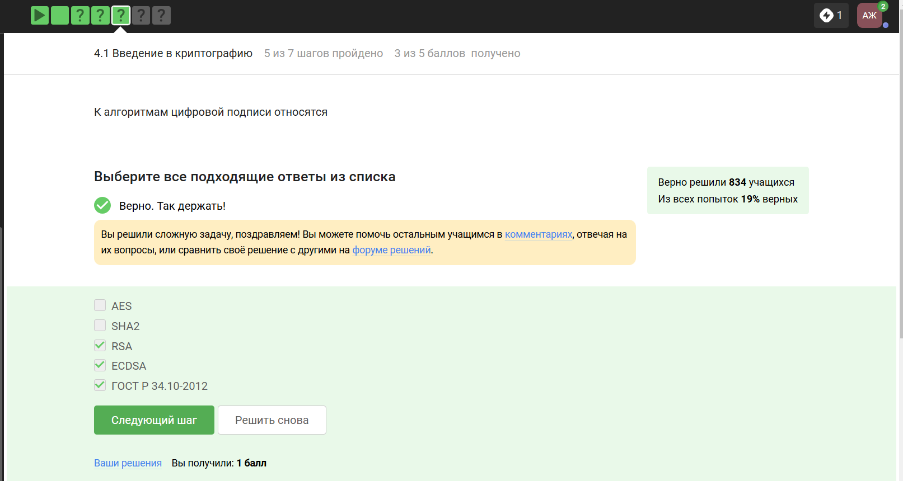
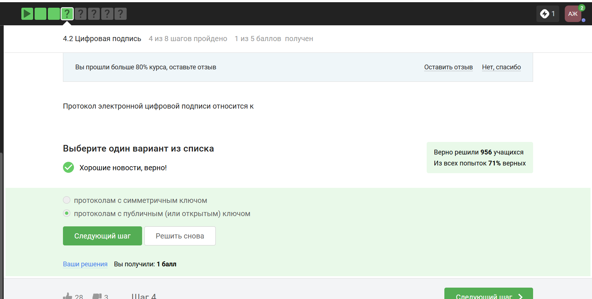
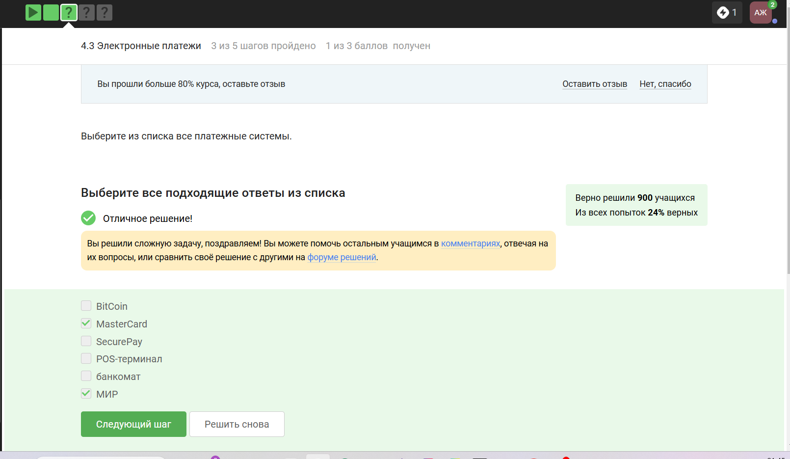
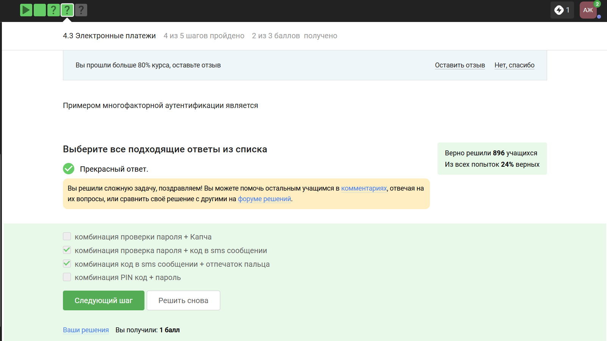
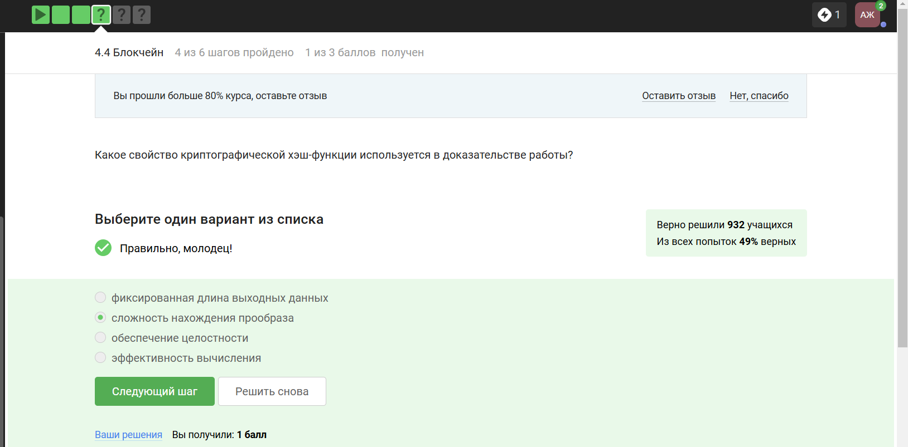
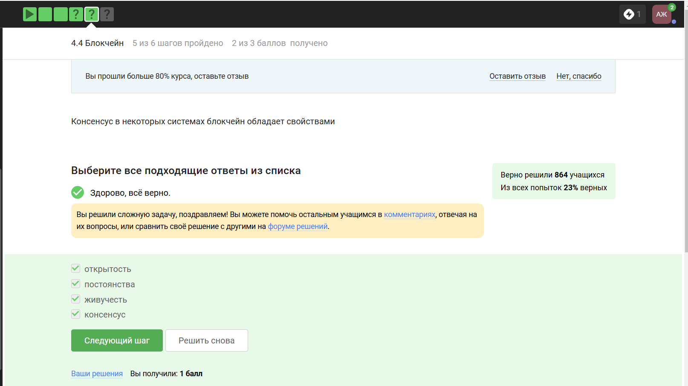
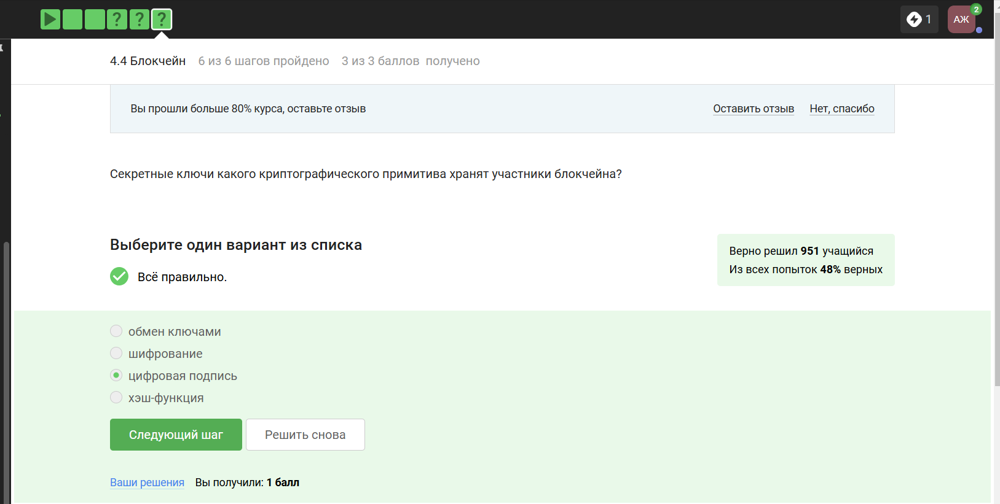

---
## Front matter
lang: ru-RU
title: Внешний курс Раздел 3. Криптография на практике
subtitle: Основы информационной безопасности
author:
  - Жукова А. А.
institute:
  - Российский университет дружбы народов, Москва, Россия
date: 17 мая 2025

## i18n babel
babel-lang: russian
babel-otherlangs: english

## Formatting pdf
toc: false
toc-title: Содержание
slide_level: 2
aspectratio: 169
section-titles: true
theme: metropolis
header-includes:
 - \metroset{progressbar=frametitle,sectionpage=progressbar,numbering=fraction}
---

# Информация

## Докладчик

:::::::::::::: {.columns align=center}
::: {.column width="70%"}

  * Жукова Арина Александровна
  * Студент бакалавриата, 2 курс
  * группа: НПИбд-03-23
  * Российский университет дружбы народов
  * [1132239120@rudn.ru](mailto:1132239120@rudn.ru)

:::
::: {.column width="30%"}

:::
::::::::::::::

# Прохождение раздела криптография на практике

##  **Введение в криптографию**

{#fig:011 width=70%}

##  **Введение в криптографию**

{#fig:012 width=70%}

##  **Введение в криптографию**

{#fig:013 width=70%}

##  **Введение в криптографию**

{#fig:014 width=70%}

##  **Введение в криптографию**

{#fig:015 width=70%}

## **Цифровая подпись**  

{#fig:021 width=70%}

## **Цифровая подпись**  

{#fig:022 width=70%}

## **Цифровая подпись**   

{#fig:023 width=70%}

## **Цифровая подпись**   

{#fig:024 width=70%}

## **Цифровая подпись**   

{#fig:025 width=70%}

## **Электронные платежи**   

{#fig:031 width=70%}

## **Электронные платежи**  

{#fig:032 width=70%}

## **Электронные платежи**  

{#fig:033 width=70%}

## **Блокчейн**   

{#fig:041 width=70%}

## **Блокчейн**   

{#fig:042 width=70%}

## **Блокчейн**   

{#fig:043 width=70%}

# Сертификат 

{#fig:0 width=70%}

## Сертификат 

{#fig:1 width=70%}

# Вывод

По прохождению данного раздела курса были изучены цифровые подписи, безопасность платежей и блокчейн. Наиболее сложными были задания на идентификацию платежных систем и свойства консенсуса. 

# Список литературы{.unnumbered}

