---
## Front matter
lang: ru-RU
title: Внешний курс. Раздел 1. Безопасность в сети
subtitle: Основы информационной безопасности
author:
  - Жукова А. А.
institute:
  - Российский университет дружбы народов, Москва, Россия
date: 17 мая 2025

## i18n babel
babel-lang: russian
babel-otherlangs: english

## Formatting pdf
toc: false
toc-title: Содержание
slide_level: 2
aspectratio: 169
section-titles: true
theme: metropolis
header-includes:
 - \metroset{progressbar=frametitle,sectionpage=progressbar,numbering=fraction}
---

# Информация

## Докладчик

:::::::::::::: {.columns align=center}
::: {.column width="70%"}

  * Жукова Арина Александровна
  * Студент бакалавриата, 2 курс
  * группа: НПИбд-03-23
  * Российский университет дружбы народов
  * [1132239120@rudn.ru](mailto:1132239120@rudn.ru)

:::
::: {.column width="30%"}

:::
::::::::::::::

# Вводная часть

##  Цель курса

Заложить основы для понимания основных принципов работы в сети 

## Задачи 

- понять, как работает Интернет, и какие у него “слабые” места

- уяснить, почему 1245YOURNAME -- плохой пароль

- научиться отличать шифрование от электронной подписи

- узнать, как работают электронные платежи

# Прохождение раздела безопасность в сети

##  Как работает интернет: базовые сетевые протоколы

{#fig:001 width=70%}

##  Как работает интернет: базовые сетевые протоколы
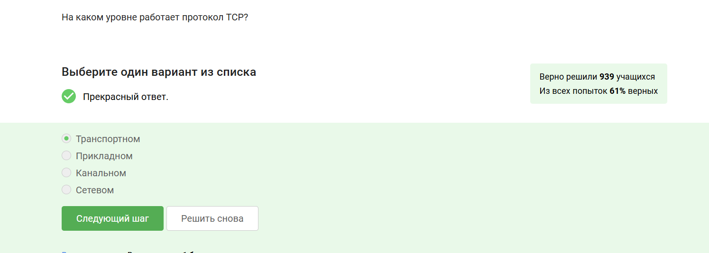{#fig:002 width=70%}

##  Как работает интернет: базовые сетевые протоколы

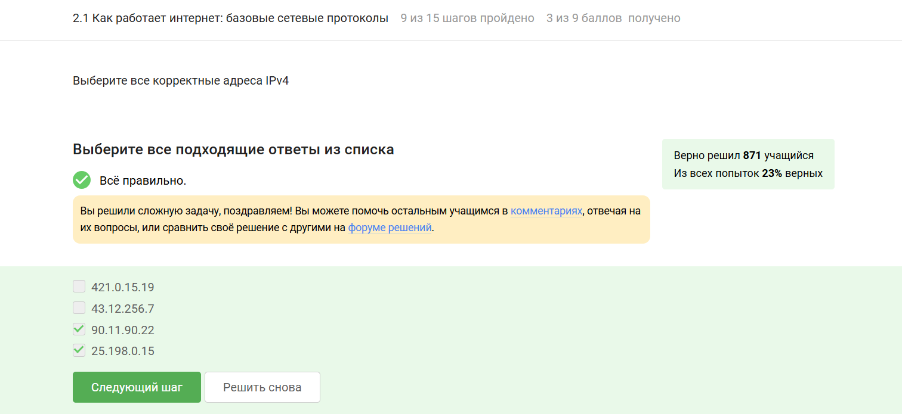{#fig:003 width=70%}

##  Как работает интернет: базовые сетевые протоколы

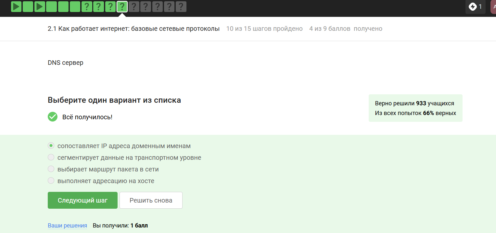{#fig:004 width=70%}

##  Как работает интернет: базовые сетевые протоколы

{#fig:005 width=70%}

##  Как работает интернет: базовые сетевые протоколы 

{#fig:006 width=70%}

##  Как работает интернет: базовые сетевые протоколы 

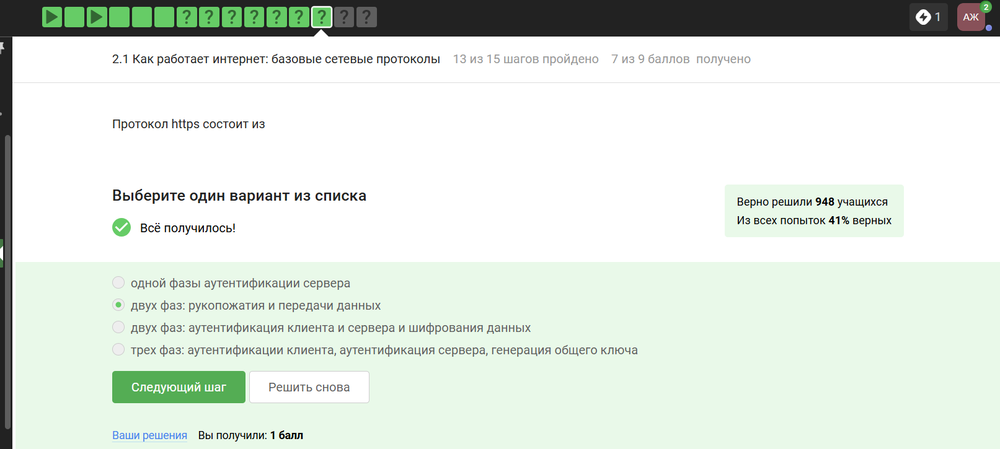{#fig:007 width=70%}

##  Как работает интернет: базовые сетевые протоколы

{#fig:008 width=70%}

##  Как работает интернет: базовые сетевые протоколы

{#fig:009 width=70%}

## **Персонализация сети**  

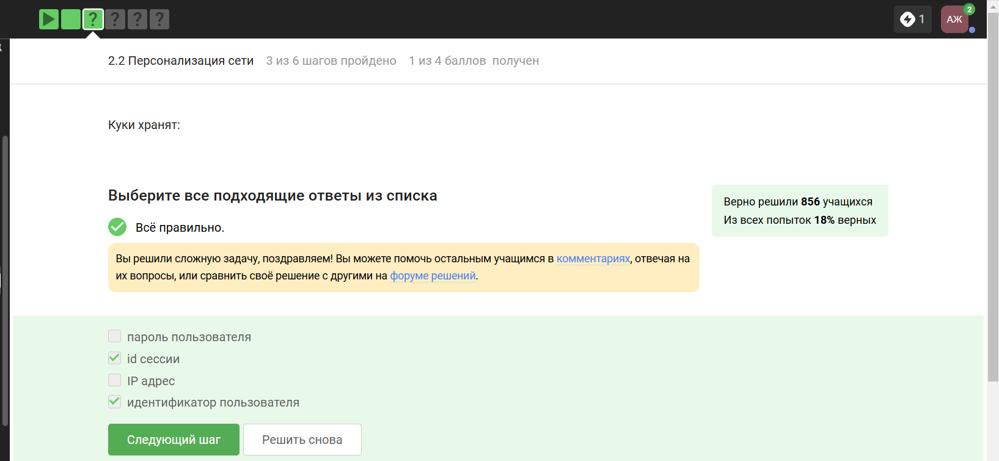{#fig:011 width=70%}

## **Персонализация сети**    

{#fig:012 width=70%}

## **Персонализация сети**    

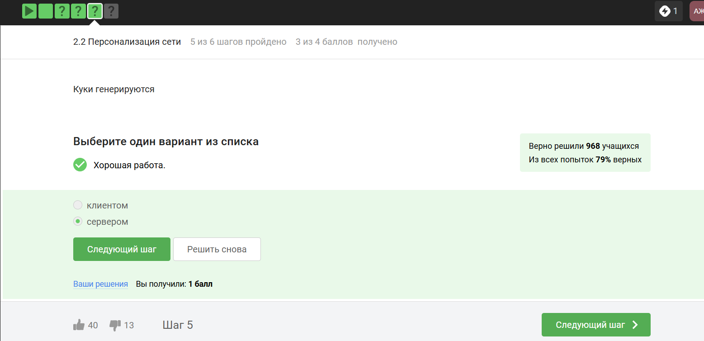{#fig:013 width=70%}

## **Персонализация сети**    

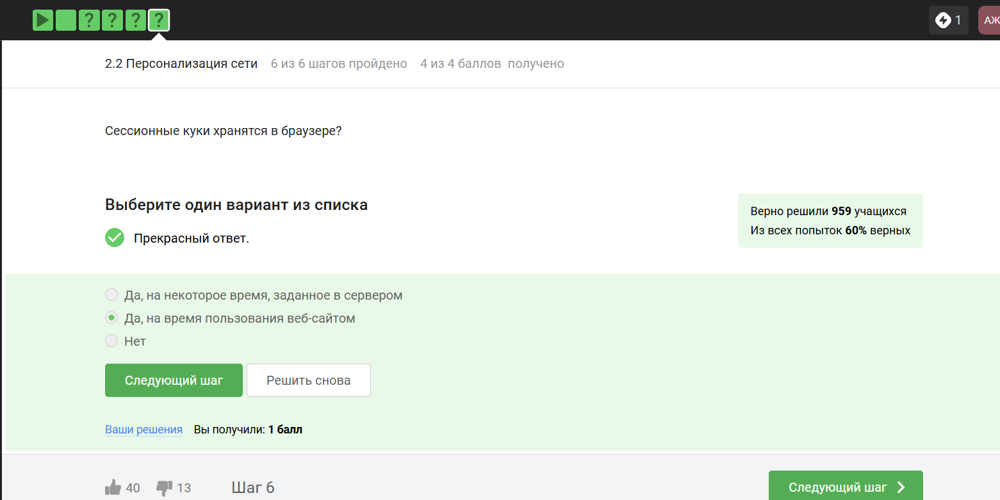{#fig:014 width=70%}

## **Браузер TOR**  

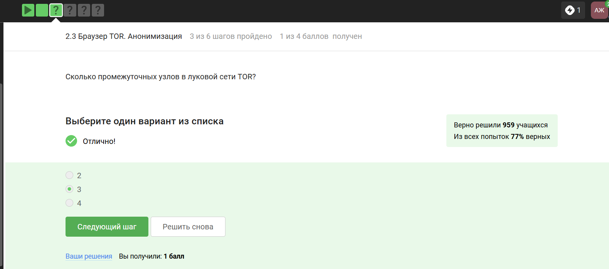{#fig:021 width=70%}

## **Браузер TOR** 

{#fig:023 width=70%}

## **Браузер TOR** 

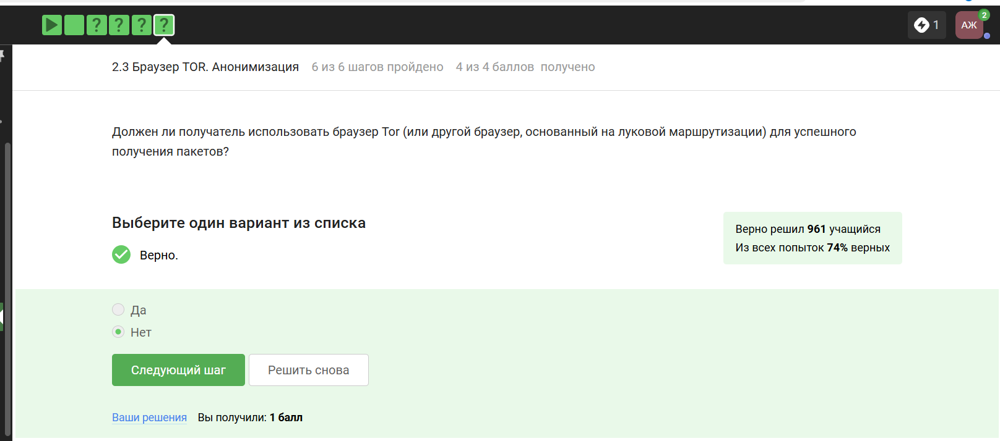{#fig:024 width=70%}

## **Беспроводные сети Wi-Fi**   

{#fig:031 width=70%}

## **Беспроводные сети Wi-Fi**  

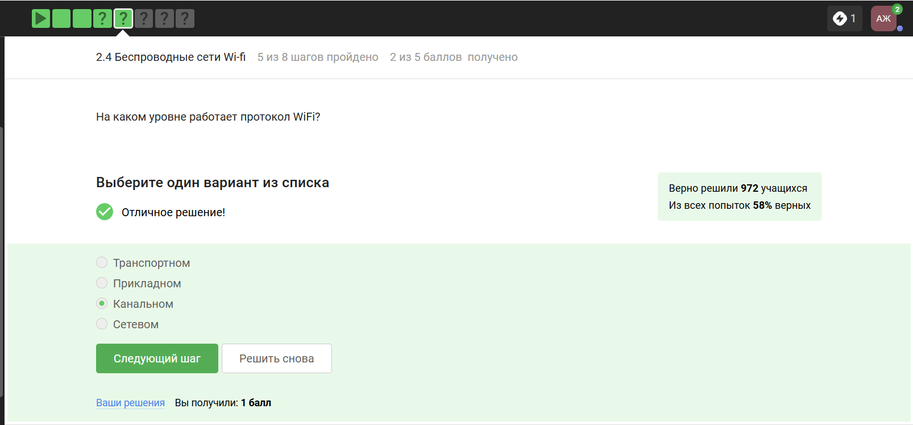{#fig:032 width=70%}

## **Беспроводные сети Wi-Fi**  

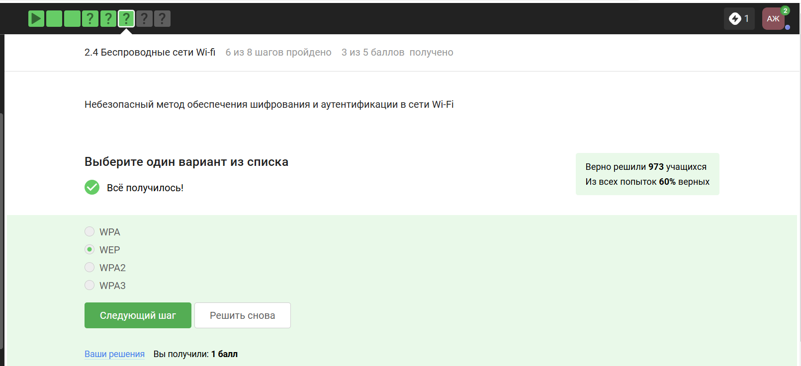{#fig:033 width=70%}

## **Беспроводные сети Wi-Fi**  

{#fig:034 width=70%}

## **Беспроводные сети Wi-Fi**   

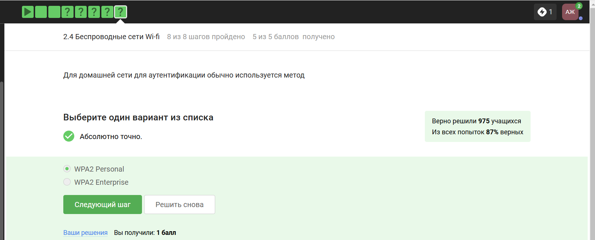{#fig:035 width=70%}  

# Вывод

По прохождению данного раздела курса были изучены базовые сетевые протоколы, узнали о персонализации сети, изучили браузер TOR и беспроводные сети Wi-Fi. 

# Список литературы{.unnumbered}

