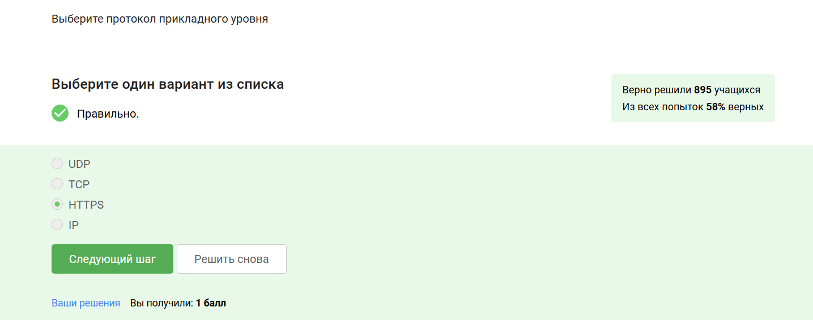
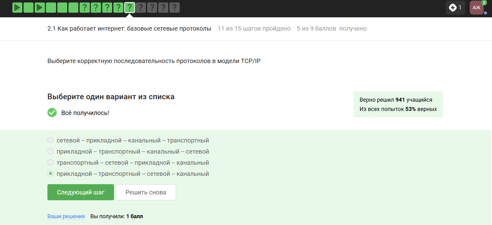
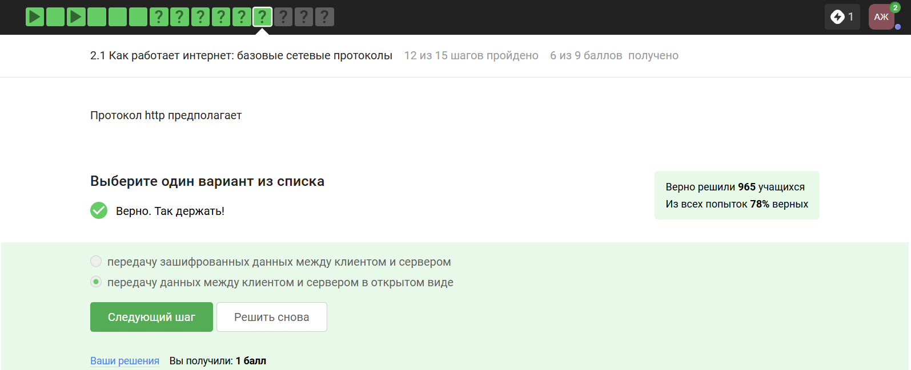
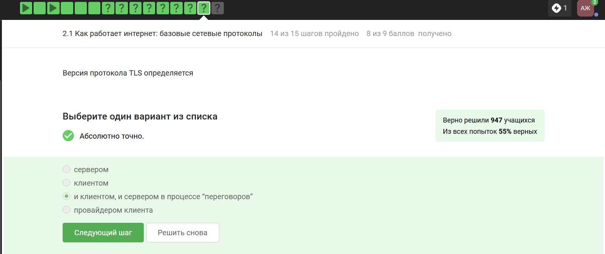
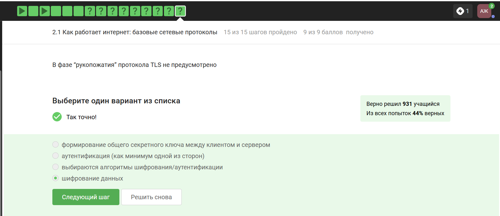
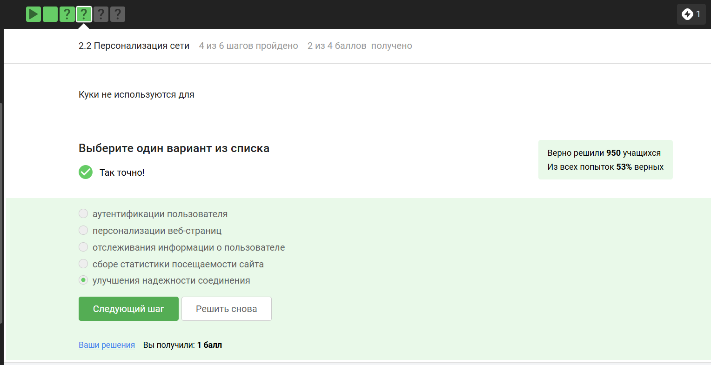
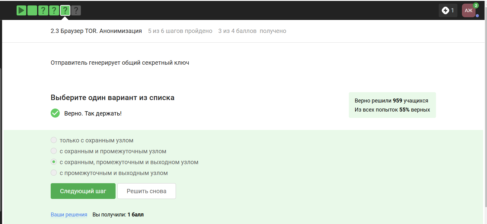
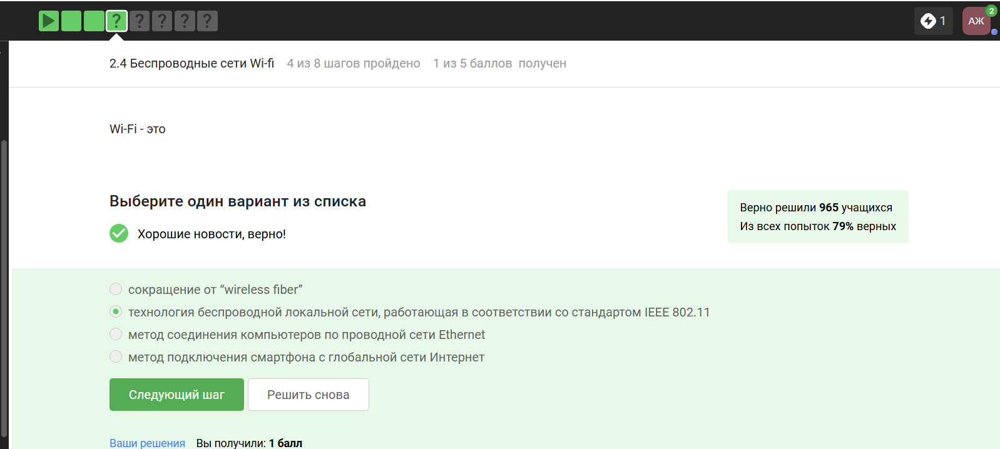
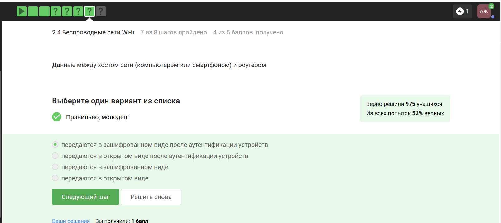

---
## Front matter
title: "Отчёт: Внешний курс"
subtitle: "Раздел 1. Безопасность в сети"
author: "Жукова Арина Александровна"

## Generic otions
lang: ru-RU
toc-title: "Содержание"

## Bibliography
bibliography: bib/cite.bib
csl: pandoc/csl/gost-r-7-0-5-2008-numeric.csl

## Pdf output format
toc: true # Table of contents
toc-depth: 2
lof: true # List of figures
lot: true # List of tables
fontsize: 12pt
linestretch: 1.5
papersize: a4
documentclass: scrreprt
## I18n polyglossia
polyglossia-lang:
  name: russian
  options:
	- spelling=modern
	- babelshorthands=true
polyglossia-otherlangs:
  name: english
## I18n babel
babel-lang: russian
babel-otherlangs: english
## Fonts
mainfont: IBM Plex Serif
romanfont: IBM Plex Serif
sansfont: IBM Plex Sans
monofont: IBM Plex Mono
mathfont: STIX Two Math
mainfontoptions: Ligatures=Common,Ligatures=TeX,Scale=0.94
romanfontoptions: Ligatures=Common,Ligatures=TeX,Scale=0.94
sansfontoptions: Ligatures=Common,Ligatures=TeX,Scale=MatchLowercase,Scale=0.94
monofontoptions: Scale=MatchLowercase,Scale=0.94,FakeStretch=0.9
mathfontoptions:
## Biblatex
biblatex: true
biblio-style: "gost-numeric"
biblatexoptions:
  - parentracker=true
  - backend=biber
  - hyperref=auto
  - language=auto
  - autolang=other*
  - citestyle=gost-numeric
## Pandoc-crossref LaTeX customization
figureTitle: "Рис."
tableTitle: "Таблица"
listingTitle: "Листинг"
lofTitle: "Список иллюстраций"
lotTitle: "Список таблиц"
lolTitle: "Листинги"
## Misc options
indent: true
header-includes:
  - \usepackage{indentfirst}
  - \usepackage{float} # keep figures where there are in the text
  - \floatplacement{figure}{H} # keep figures where there are in the text
---

#  Цель курса

Заложить основы для понимания основных принципов работы в сети 

# Задачи 

- понять, как работает Интернет, и какие у него “слабые” места

- уяснить, почему 1245YOURNAME -- плохой пароль

- научиться отличать шифрование от электронной подписи

- узнать, как работают электронные платежи

# Теоретическое введение 

Сетевые протоколы — это правила, по которым устанавливается соединение между устройствами сети и происходит обмен данными.

Модель TCP/IP — это модель, по которой работает современный интернет. Она включает в себя четыре уровня:

Прикладной уровень — на этом уровне работают пользовательские программы. Каждая программа использует свой протокол. Например, браузеры и веб-страницы используют протокол HTTP или HTTPS.

Транспортный уровень — обеспечивает передачу данных между процессами на одной машине или хосте. На этом уровне работают протоколы TCP и UDP. TCP обеспечивает надёжную передачу пакетов, а UDP — скорость передачи данных.

Сетевой (межсетевой) уровень — ответственен за передачу данных между устройствами сети.

Протоколы транспортного уровня:
TCP (Transmission Control Protocol)— обеспечивает надёжную передачу пакетов. UDP (User Datagram Protocol) — не обеспечивает надёжную передачу данных, но обеспечивает скорость передачи.

Cookies (куки) — это данные, которые передаются от сервера клиенту для его идентификации. Они помогают сохранять сессионную информацию и персонализировать страницы.

Виды cookies:
Полезные — облегчают взаимодействие с некоторыми сайтами (например, запоминают содержимое корзины в интернет-магазине). Навязчивые — могут использоваться для отслеживания действий пользователей в сети, что иногда приводит к показу персонализированной рекламы.

Для чего нужны cookies:
Позволяют сохранять информацию о пользователе и его действиях на сайте. Обеспечивают сохранение авторизации пользователя на сайте после обновления страницы.

Помогают персонализировать интерфейс сайта (например, смена языка страницы).

Куки содержат переменные с определёнными значениями, которые хранятся в браузере и позволяют идентифицировать последующие запросы как запросы от уже авторизованного пользователя.

Tor и луковая маршрутизация

Tor — это проект, который предоставляет бесплатный браузер для анонимного сёрфинга в интернете. Название проекта является аббревиатурой от The Onion Router (луковый маршрутизатор).

Основные задачи браузера Tor:
анонимность пользователя; конфиденциальность информации, передаваемой по сети.

Принцип работы луковой маршрутизации:

В луковой модели маршрутизации есть охранный, промежуточный и выходной узлы.

Выходной узел знает, кому направлен пакет, а охранный узел — от кого пришёл пакет. Промежуточный узел не знает ни отправителя, ни получателя.

В браузере Tor всегда используется три роутера.

Отправитель генерирует общие ключи с охранным, промежуточным и выходным узлами с помощью криптографического алгоритма.

Отправитель шифрует данные под каждым из ключей и отправляет их в сеть.

Каждый узел дешифрует данные под своим ключом и передаёт их следующему узлу.

Выходной узел дешифрует данные и перенаправляет их получателю.

Таким образом, луковая маршрутизация обеспечивает анонимность и конфиденциальность информации в сети. Однако идеальной реализации таких браузеров не существует, и существуют различные способы атак.

WiFi — это технология беспроводной локальной сети, основанная на стандарте IEEE 802.11. Современные стандарты, такие как 802.11ac (WiFi5) и 802.11ax, обеспечивают высокую скорость передачи данных.

Режимы работы WiFi:
Инфраструктурный— классический режим работы, при котором роутер раздаёт интернет в определённом периметре. У роутера есть имя (SSID), которое видно при поиске доступных сетей. Ad-Hoc — режим, при котором устройства могут присоединиться друг к другу без участия роутера.

Методы обеспечения безопасности в сетях WiFi:

С развитием стандартов WiFi модифицировались и методы обеспечения безопасности. Самый ранний и небезопасный метод шифрования данных — WEP. Он использовал малую длину ключа (например, 40 бит), что делало его уязвимым для взлома. На сегодняшний день считается безопасным использование ключа длиной 128 бит.

# Прохождение раздела безопасность в сети

##  Как работает интернет: базовые сетевые протоколы

**1. Формулировка задания:** *Выберите протокол прикладного уровня.*  

**Варианты ответа:** 

- [x] HTTPS  
- [ ] UDP  
- [ ] TCP  
- [ ] IP  

{#fig:001 width=70%}

**3. Обоснование ответа** 

HTTPS относится к прикладному уровню модели TCP/IP, так как обеспечивает взаимодействие приложений (например, браузера и сервера). UDP и TCP — транспортные протоколы, IP — сетевой.  

**2. Формулировка задания:** *На каком уровне работает протокол TCP?*  

**Варианты ответа** 

- [x] Транспортном  
- [ ] Прикладном  
- [ ] Канальном 
- [ ] Сетевом

{#fig:002 width=70%}

**Обоснование ответа**  
TCP — протокол транспортного уровня, отвечающий за надежную доставку данных между приложениями.  

**3. Формулировка задания**: *Выберите корректные адреса IPv4.*  

**Варианты ответа**  
- [x] 90.11.90.22  
- [x] 25.198.0.15  
- [ ] 421.0.15.19 (некорректно: 421 > 255)  
- [ ] 43.12.256.7 (некорректно: 256 > 255)  

{#fig:003 width=70%}

**Обоснование ответа**  
Каждый октет IPv4 должен находиться в диапазоне 0–255.  

**4. Формулировка задания** *DNS сервер:*  

**Варианты ответа**  

- [x] сопоставляет IP-адреса доменным именам  
- [ ] сегментирует данные на транспортном уровне
- [ ] выбирает маршрут пакета в сети (это функция сетевого уровня)
- [ ] выполняет адресацию на хосте

{#fig:004 width=70%}

**Обоснование ответа** 

DNS преобразует доменные имена (например, `google.com`) в IP-адреса.  

**5. Формулировка задания**  *Выберите корректную последовательность протоколов в модели TCP/IP.*  

**Варианты ответа**  

- [ ] сетевой -- прикладной -- канальный -- транспортный
- [ ] прикладной -- транспортный -- канальный -- сетевой
- [ ] транспортный -- сетевой -- прикладной -- канальный 
- [x] прикладной – транспортный – сетевой – канальный  

{#fig:005 width=70%}

**Обоснование ответа** 

Модель TCP/IP включает 4 уровня: прикладной, транспортный, сетевой, канальный.  

**6. Формулировка задания**  *Протокол HTTP предполагает:*  

**Варианты ответа** 

- [ ] передачу зашифрованных данных между клиентом и сервером
- [x] передачу данных между клиентом и сервером в открытом виде 

{#fig:006 width=70%}

**Обоснование ответа**  

HTTP не шифрует данные. Для защиты используется HTTPS, который добавляет шифрование через TLS/SSL.  

**7. Формулировка задания**  *Протокол HTTPS состоит из:*  

**Варианты ответа**  

- [ ] одной фазы аутентификации сервера
- [x] двух фаз: рукопожатия и передачи данных
- [ ] двух фаз: аутентификация клиента и сервера и шифрования данных
- [ ] трех фаз: аутентификации клиента, аутентификация сервера, генерация общего ключа 

{#fig:007 width=70%}

**Обоснование ответа**  

Фазы HTTPS:  
1. Рукопожатие (аутентификация, обмен ключами).  
2. Передача зашифрованных данных.  

**8. Формулировка задания**  *Версия протокола TLS определяется:*  

**Варианты ответа** 

- [ ] сервером
- [ ] клиентом
- [x] и клиентом, и сервером в процессе “переговоров”
- [ ] провайдером клиента

{#fig:008 width=70%}

**Обоснование ответа** 

Версия TLS согласуется во время рукопожатия, где клиент и сервер выбирают самую новую поддерживаемую версию.  

**9. Формулировка задания**  *В фазе "рукопожатия" TLS не предусмотрено:*  

**Варианты ответа**  

- [ ] формирование общего секретного ключа между клиентом и сервером
- [ ] аутентификация (как минимум одной из сторон)
- [ ] выбираются алгоритмы шифрования/аутентификации
- [x] шифрование данных 

{#fig:009 width=70%}

**Обоснование ответа**  

Шифрование данных начинается **после** рукопожатия. На этапе рукопожатия происходит обмен ключами и аутентификация.  

## **Персонализация сети**  

**1. Формулировка задания**  *Куки хранят:*  

**Варианты ответа**  

- [ ] пароль пользователя  
- [x] id сессии  
- [ ] IP-адрес  
- [x] идентификатор пользователя  

{#fig:011 width=70%}

**Обоснование ответа**  

Куки сохраняют данные для персонализации (например, идентификатор сессии), но не пароли или IP-адреса.  

**2. Формулировка задания**  *Куки не используются для:*  

**Варианты ответа**  

- [ ] аутентификации пользователя
- [ ] персонализации веб-страниц
- [ ] отслеживания информации о пользователе
- [ ] сборе статистики посещаемости сайта
- [x] улучшения надежности соединения  

{#fig:012 width=70%}

**Обоснование ответа**

Куки предназначены для хранения данных сессии и персонализации, но **не влияют** на надежность сетевого соединения.

**3. Формулировка задания**  *Куки генерируются:*  

**Варианты ответа**  

- [x] сервером  
- [ ] клиентом  

{#fig:013 width=70%}

**Обоснование ответа**  

Куки создаются сервером и передаются клиенту через HTTP-заголовки для последующего хранения.  

**4. Формулировка задания**  *Сессионные куки хранятся в браузере?*  

**Варианты ответа**  

- [ ] Да, на некоторое время, заданное в сервером
- [ ] Нет  
- [x] Да, на время пользования веб-сайтом  

{#fig:014 width=70%}

**Обоснование ответа**  

Сессионные куки удаляются после закрытия браузера или завершения сессии.  

## **Браузер TOR**  

**1. Формулировка задания**  *Сколько промежуточных узлов в луковой сети TOR?*  

**Варианты ответа**  

- [x] 3  
- [ ] 2  
- [ ] 4  

{#fig:021 width=70%}

**Обоснование ответа**  

Стандартная цепочка TOR включает три узла: охранный (entry), промежуточный (middle) и выходной (exit).  

**3. Формулировка задания**  *С кем отправитель генерирует общий секретный ключ?*  

**Варианты ответа**  

- [ ] только с охранным узлом
- [ ] с охранным и промежуточным узлом
- [x] с охранным, промежуточным и выходном узлом
- [ ] с промежуточным и выходным узлом 

{#fig:023 width=70%}

**Обоснование ответа**  

Каждый узел в цепочке TOR участвует в создании многослойного шифрования, поэтому ключи устанавливаются со всеми тремя узлами.  

**4. Формулировка задания**  *Должен ли получатель использовать TOR для получения пакетов?*  

**Варианты ответа** 

- [x] Нет  
- [ ] Да  

{#fig:024 width=70%}

**Обоснование ответа** 

Получатель видит только выходной узел TOR. Для дешифровки данных ему не требуется использовать TOR.  

## **Беспроводные сети Wi-Fi** 

**1. Формулировка задания**  *Что такое Wi-Fi?*  

**Варианты ответа** 

- [ ] сокращение от “wireless fiber”
- [x] технология беспроводной локальной сети (стандарт IEEE 802.11)  
- [ ] метод соединения компьютеров по проводной сети Ethernet
- [ ] метод подключения к глобальной сети  

{#fig:031 width=70%}

**Обоснование ответа** 

Wi-Fi обеспечивает беспроводное соединение в локальной сети, соответствующее стандарту IEEE 802.11.  

**2. Формулировка задания**  *На каком уровне работает протокол Wi-Fi?*  

**Варианты ответа**  

- [ ] Транспортном 
- [ ] Прикладном
- [x] Канальном 
- [ ] Сетевом 

{#fig:032 width=70%}

**Обоснование ответа**  

Wi-Fi относится к канальному уровню (L2 модели OSI), управляя передачей данных в локальной сети.  

**3. Формулировка задания**  *Небезопасный метод шифрования в Wi-Fi:*  

**Варианты ответа** 

- [ ] WPA
- [x] WEP  
- [ ] WPA2
- [ ] WPA3 

{#fig:033 width=70%}

**Обоснование ответа** 

WEP (Wired Equivalent Privacy) устарел и содержит криптографические уязвимости, в отличие от WPA2/WPA3.  

**4. Формулировка задания**  *Данные между хостом и роутером передаются:*  

**Варианты ответа** 

- [ ] передаются в зашифрованном виде
- [x] передаются в зашифрованном виде после аутентификации устройств
- [ ] передаются в открытом виде
- [ ] передаются в открытом виде после аутентификации устройств 

{#fig:034 width=70%}

**Обоснование ответа**  

После успешной аутентификации (например, по WPA2) данные шифруются для защиты от перехвата.  

**5. Формулировка задания**  *Для домашней сети для аутентификации обычно используется метод:*  

**Варианты ответа** 

- [x] WPA2 Personal  
- [ ] WPA2 Enterprise  

{#fig:035 width=70%}

**Обоснование ответа**  

WPA2 Personal использует общий ключ (пароль), а Enterprise требует сервера RADIUS, что не применяется в домашних условиях.  

# Вывод

По прохождению данного раздела курса были изучены базовые сетевые протоколы, узнали о персонализации сети, изучили браузер TOR и беспроводные сети Wi-Fi. 

# Список литературы{.unnumbered}

::: {#refs}
::: 
