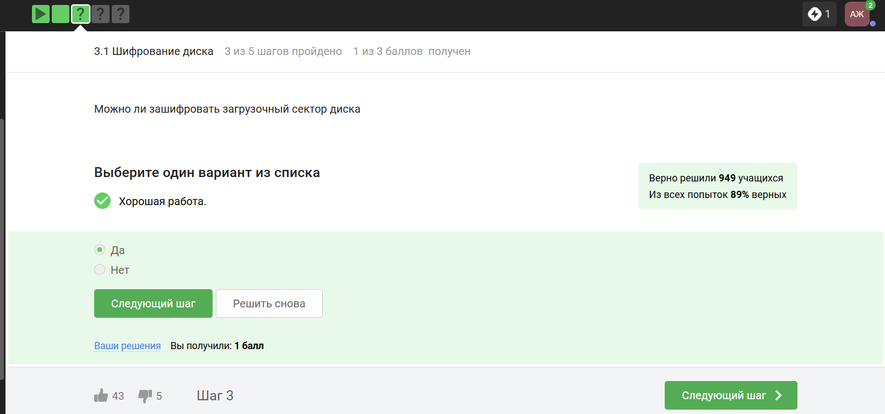
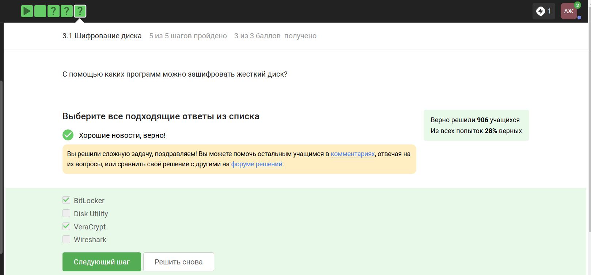
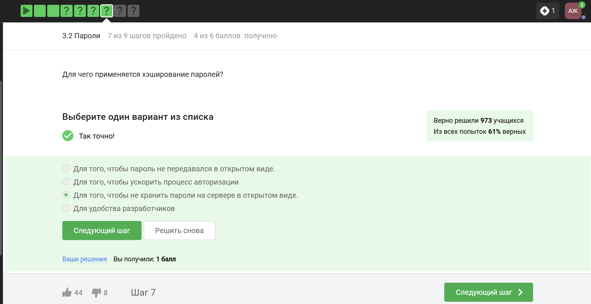
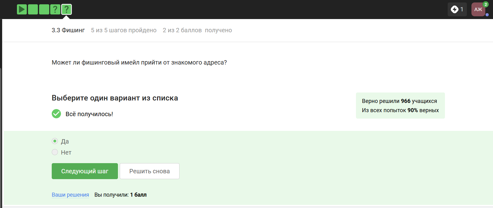

---
## Front matter
title: "Отчёт: Внешний курс"
subtitle: "Раздел 2. Защита ПК/телефона"
author: "Жукова Арина Александровна"

## Generic otions
lang: ru-RU
toc-title: "Содержание"

## Bibliography
bibliography: bib/cite.bib
csl: pandoc/csl/gost-r-7-0-5-2008-numeric.csl

## Pdf output format
toc: true # Table of contents
toc-depth: 2
lof: true # List of figures
lot: true # List of tables
fontsize: 12pt
linestretch: 1.5
papersize: a4
documentclass: scrreprt
## I18n polyglossia
polyglossia-lang:
  name: russian
  options:
	- spelling=modern
	- babelshorthands=true
polyglossia-otherlangs:
  name: english
## I18n babel
babel-lang: russian
babel-otherlangs: english
## Fonts
mainfont: IBM Plex Serif
romanfont: IBM Plex Serif
sansfont: IBM Plex Sans
monofont: IBM Plex Mono
mathfont: STIX Two Math
mainfontoptions: Ligatures=Common,Ligatures=TeX,Scale=0.94
romanfontoptions: Ligatures=Common,Ligatures=TeX,Scale=0.94
sansfontoptions: Ligatures=Common,Ligatures=TeX,Scale=MatchLowercase,Scale=0.94
monofontoptions: Scale=MatchLowercase,Scale=0.94,FakeStretch=0.9
mathfontoptions:
## Biblatex
biblatex: true
biblio-style: "gost-numeric"
biblatexoptions:
  - parentracker=true
  - backend=biber
  - hyperref=auto
  - language=auto
  - autolang=other*
  - citestyle=gost-numeric
## Pandoc-crossref LaTeX customization
figureTitle: "Рис."
tableTitle: "Таблица"
listingTitle: "Листинг"
lofTitle: "Список иллюстраций"
lotTitle: "Список таблиц"
lolTitle: "Листинги"
## Misc options
indent: true
header-includes:
  - \usepackage{indentfirst}
  - \usepackage{float} # keep figures where there are in the text
  - \floatplacement{figure}{H} # keep figures where there are in the text
---

#  Цель курса

Заложить основы для понимания основных принципов работы в сети 

# Задачи 

- понять, как работает Интернет, и какие у него “слабые” места

- уяснить, почему 1245YOURNAME -- плохой пароль

- научиться отличать шифрование от электронной подписи

- узнать, как работают электронные платежи

# Теоретическое введение 

Шифрование жёсткого диска — это процесс преобразования данных в зашифрованный вид для защиты от несанкционированного доступа в случае утери или кражи устройства.

Этапы шифрования жёсткого диска:

Генерация ключа для шифрования с помощью специальной программы (утилиты). Пользователь запоминает пароль, который позволяет разблокировать ключ шифрования и дешифрования.

Шифрование данных с помощью ключа. Программа берёт ключ и шифрует данные.

Дешифрование данных при необходимости доступа к ним. Алгоритм дешифрования использует тот же ключ для получения исходных данных.

Для шифрования больших объёмов данных (например, жёсткого диска) используется симметричное шифрование, как правило, алгоритм AES. Этот алгоритм эффективен и быстро реализуется на аппаратном уровне, что позволяет минимизировать задержки в работе.

Хранение ключа — важный аспект шифрования. Хранить ключ на том же диске, который шифруется, бессмысленно, поэтому существуют различные способы хранения ключей: у администратора, на физических носителях (флешках или токенах), на защищённых облачных серверах антивирусных компаний.

Утилиты для шифрования носителей:
во всех популярных операционных системах есть встроенные утилиты: в Windows это Bitlocker, в Linux – LUKS, в macOS – FileVault; существуют сторонние опенсорсные (бесплатные) программы, например, Veracrypt, PGPDisk.

Пароли и их стойкость

Пароли используются для аутентификации в различных сервисах. Их стойкость определяется сложностью перебора.

Основной критерий стойкости пароля — это сложность его перебора. Чем больше возможных комбинаций, тем сложнее подобрать пароль.

При создании пароля его автоматически проверяют на стойкость. Проверяется длина и состав пароля: из какого алфавита он состоит (цифры, буквы нижнего и верхнего регистра, спецсимволы). Рекомендуется использовать как минимум один спецсимвол, одну цифру и одну букву верхнего и нижнего регистра.

Самые частые пароли — это «12345», «password», «qwerty». Они легко поддаются перебору, поэтому их использование небезопасно.

Защиты от взлома пароля включают ограничение числа попыток ввода (например, для PIN-кодов).

Фишинг — это вид интернет-мошенничества, при котором злоумышленник маскируется под реальный сервис, интернет-страницу или продукт, чтобы получить конфиденциальную информацию пользователя.

Типы фишинговых атак:
Адресный фишинг — рассылка писем с вредоносными ссылками. Телефонный фишинг — мошеннические звонки с целью получения конфиденциальной информации.
Календарный фишинг — отправка ссылок на якобы события в календаре, которые на самом деле ведут на вредоносные сайты или ПО. Фишинг в мессенджерах — использование мессенджеров для распространения вредоносных ссылок.

Email spoofing (спуфинг) — подмена адреса отправителя. Злоумышленники могут отправлять фишинговые письма от имени знакомых людей. Это возможно из-за того, что классический протокол отправки писем (SMTP) не включает проверку адреса отправителя. Для защиты используются расширения протокола SMTP, такие как SPF (Sender Policy Framework) и DMARC.

Как защититься от фишинга:
Не открывать вложения и ссылки в письмах от незнакомых людей. Перепроверять неожиданные письма от знакомых.
Избегать подозрительных объектов в письмах — кнопок, картинок, QR-кодов, ссылок. Настроить почтовый клиент для фильтрации спама.

Не регистрировать свою почту на малоизвестных почтовых сервисах.

Вирусы и вредоносное ПО

Червь — это тип вредоносного ПО, который распространяется по сети с помощью фишинговых атак. Один из самых известных и дорогих червей — Mydoom. Он работал на операционных системах от Microsoft и распространялся по почте в виде письма с пометкой «Mail Delivery System» и вредоносным вложением. Ущерб от Mydoom оценивается в 38 миллионов долларов.

Троян — это вирус, который проникает в систему под видом легитимного программного обеспечения. Например, Sobig — это почтовый червь и троян, который также распространялся по почте с невинным письмом и вредоносным вложением.

Программа-вымогатель (ransomware) — это вирус, который шифрует данные и требует оплаты за ключ дешифрования. Например, WannaCry — это программа-вымогатель, которая использовала уязвимость протокола SMB в Windows. Ущерб от WannaCry оценивается в несколько миллионов долларов.

Существуют также вирусы, нацеленные на сбор приватной информации, например, Pegasus — шпионский вирус для смартфонов. Он маскируется под легитимное приложение и устанавливается через SMS, WhatsApp или iMessage. Pegasus позволяет считывать данные со смартфона, включая SMS, emails, геолокацию, контакты, а также делать скриншоты и записывать нажатия клавиш.

Для защиты от вирусов и вредоносного ПО рекомендуется делать бэкапы данных.

Безопасность сообщений в мессенджерах

Для обеспечения безопасности мессенджеров выдвигаются следующие требования:
корректная доставка сообщений; конфиденциальность сообщений;
аутентификация участников коммуникации; устойчивость к потере сообщений;
прямая секретность (forward secrecy) — гарантия безопасности сообщений в прошлом до компрометации ключа; возможность восстановления конфиденциальности после компрометации ключа.

Протокол Signal

Signal — это протокол, который лежит в основе многих мессенджеров, таких как WhatsApp и Skype. Он обеспечивает конфиденциальность сообщений с помощью сквозного шифрования (End-to-End encryption, E2E).

Суть сквозного шифрования заключается в том, что сервер, который передаёт сообщение, знает только то, куда эти сообщения должны быть направлены, но сообщения он передаёт в зашифрованном виде.

Процесс отправки сообщения

Алиса шифрует свои данные и кладёт на сервере шифр-текст с пометкой, что этот шифр-текст предназначен для Боба.

Когда Боб заходит в сеть, сервер отправляет ему шифр-текст от Алисы.

Боб получает шифр-текст, дешифрует его и получает сообщение в открытом виде.

При этом сервер не знает ни ключ, с помощью которого Алиса шифровала сообщение, ни само сообщение в открытом виде.

В протоколах Signal сквозное шифрование реализовано в два шага:

Генерация общего ключа. Боб публикует на сервере свою открытую информацию (открытый кусочек своего ключа). Алиса берёт этот открытый кусочек ключа от Боба, генерирует общий ключ и с помощью этого общего ключа отправляет сообщение, зашифрованное под этим общим ключом, Бобу.

Обмен кусочками открытых ключей. Кроме зашифрованного сообщения, Алиса отправляет Бобу свой кусочек открытого ключа. Боб, получив этот кусочек открытого ключа и имея какую-то свою секретную информацию, формирует тот же самый общий ключ, с помощью которого Алиса зашифровала сообщение.

# Прохождение

##   Шифрование диска

**№1** 

**1. Формулировка задания**  *Можно ли зашифровать загрузочный сектор диска?*  

**2. Варианты ответа**  

- [x] Да  
- [ ] Нет  

{#fig:011 width=70%}

**3. Обоснование ответа**  
Программы вроде BitLocker или VeraCrypt поддерживают полное шифрование диска, включая загрузочный сектор.  

**№2** 

**1. Формулировка задания**  *Шифрование диска основано на:*  

**2. Варианты ответа**  

- [x] симметричном шифровании  
- [ ] асимметричном шифровании  

{#fig:012 width=70%}

**3. Обоснование ответа**  
Симметричное шифрование (AES) используется для скорости обработки больших объёмов данных.  

**№3**

**1. Формулировка задания**  *Программы для шифрования диска:*  

**2. Варианты ответа**  
- [x] BitLocker  
- [x] VeraCrypt  
- [ ] Wireshark  

{#fig:013 width=70%}

**3. Обоснование ответа**  
BitLocker (Windows) и VeraCrypt (кроссплатформенный) — специализированные инструменты. Wireshark — анализатор трафика.  

## **Пароли**  

**№1**

**1. Формулировка задания**  *Стойкий пароль:*  

**2. Варианты ответа**  
- [x] UQ79@j4iSS  
- [ ] qwertty12345  

{#fig:021 width=70%}

**3. Обоснование ответа**  
Стойкий пароль содержит комбинацию букв (верхний/нижний регистр), цифр и спецсимволов.  

**№2**

**1. Формулировка задания**  *Где безопасно хранить пароли?*  

**2. Варианты ответа**  
- [x] В менеджерах паролей  
- [ ] На стикере  

{#fig:022 width=70%}

**3. Обоснование ответа**  
Менеджеры паролей (например, 1Password, LastPass) шифруют данные и защищают их мастер-паролем.  

**№3**

**1. Формулировка задания**  *Зачем нужна капча?*  

**2. Варианты ответа**  
- [x] защита от автоматизированных атак  
- [ ] замена паролей  

{#fig:023 width=70%}

**3. Обоснование ответа**  
CAPTCHA проверяет, что действие выполняет человек, а не бот.  

**№4**

**1. Формулировка задания**  *Для чего применяется хэширование паролей?*  

**2. Варианты ответа**  
- [x] Чтобы не хранить пароли на сервере в открытом виде.  
- [ ] Для ускорения авторизации  

{#fig:024 width=70%}

**3. Обоснование ответа**  
Хэширование преобразует пароль в уникальную строку, которую невозможно обратно преобразовать, что защищает данные при утечке.  

**№5**

**1. Формулировка задания**  *Поможет ли соль защитить пароли от атак перебором?*  

**2. Варианты ответа**  
- [x] Да  
- [ ] Нет  

{#fig:025 width=70%}

**3. Обоснование ответа**  
Соль добавляет случайные данные к паролю, делая предварительно вычисленные хэши (радужные таблицы) бесполезными.  

**№6**

**1. Формулировка задания**  *Меры защиты от атак перебором:*  

**2. Варианты ответа**  
- [x] разные пароли на всех сайтах  
- [x] сложные/длинные пароли  
- [x] капча  
- [x] периодическая смена паролей

{#fig:026 width=70%}

**3. Обоснование ответа**  
Сложные пароли усложняют подбор, капча блокирует ботов, а уникальные пароли снижают риски при утечке.  

## **Фишинг**  

**№1**

**1. Формулировка задания**  *Фишинговые ссылки:*  

**2. Варианты ответа**  
- [x] https://online.sberbank.wix.ru/...  
- [x] https://passport.yandex.ucoz.ru/...  

{#fig:031 width=70%}

**3. Обоснование ответа**  
Домены `wix.ru` и `ucoz.ru` не принадлежат Сбербанку и Яндексу, что указывает на подделку.  

**№2**

**1. Формулировка задания**  *Может ли фишинговое письмо прийти от знакомого адреса?*  

**2. Варианты ответа**  
- [x] Да  
- [ ] Нет  

{#fig:032 width=70%}

**3. Обоснование ответа**  
Злоумышленники подменяют адрес отправителя (спуфинг), чтобы обмануть жертву.  

## **Вирусы**  

**№1**

**1. Формулировка задания**  *Email спуфинг — это:*  

**2. Варианты ответа**  
- [x] подмена адреса отправителя в письмах  
- [ ] метод предотвращения фишинга  

{#fig:041 width=70%}

**3. Обоснование ответа**  
Спуфинг позволяет отправлять письма от имени доверенных источников для обмана получателя.  

**№2**

**1. Формулировка задания**  *Вирус-троян:*  

**2. Варианты ответа**  
- [x] маскируется под легитимную программу  
- [ ] шифрует данные  

{#fig:042 width=70%}

**3. Обоснование ответа**  
Троян скрывается под видом полезного ПО, чтобы пользователь сам его установил.  

---

## **Безопасность мессенджеров**  

**№1**

**1. Формулировка задания**  *Когда формируется ключ шифрования в Signal?*  

**2. Варианты ответа**  
- [x] при каждом новом сообщении  
- [ ] при установке приложения  

{#fig:051 width=70%}

**3. Обоснование ответа**  
Протокол Signal (Double Ratchet) обновляет ключи для каждого сообщения, обеспечивая повышенную безопасность.  

**№2**

**1. Формулировка задания**  *Суть сквозного шифрования:*  

**2. Варианты ответа**  
- [x] сообщения передаются напрямую без участия сервера  
- [ ] сервер перешифровывает данные  

{#fig:052 width=70%}

**3. Обоснование ответа**  
Сообщения шифруются на устройстве отправителя и расшифровываются только получателем, исключая доступ третьих сторон.  

---

# Выводы

По прохождению данного раздела мы получили информацию по выбору стойких паролей и использованию менеджеров паролей, курс раскрыл методы защиты от фишинга, особенности вредоносного ПО и принципы безопасной коммуникации в мессенджерах.

# Список литературы{.unnumbered}

::: {#refs}
:::
