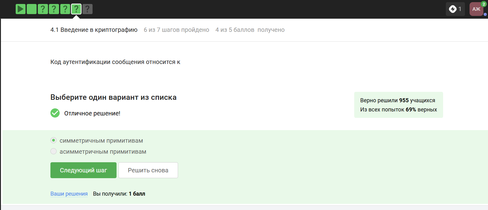
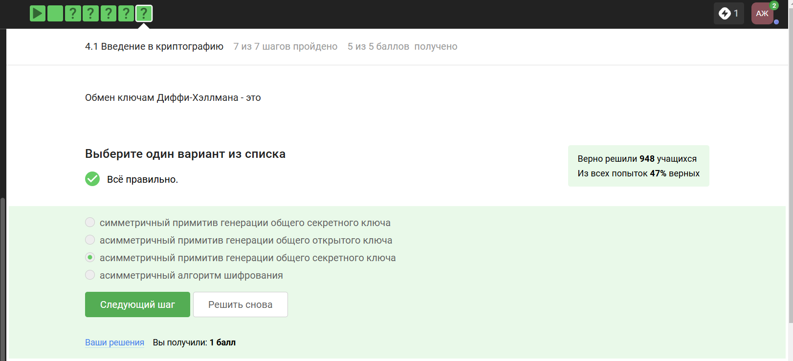
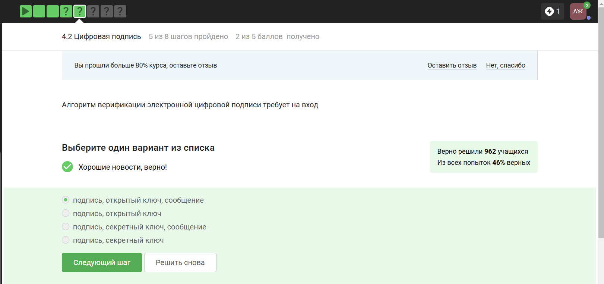
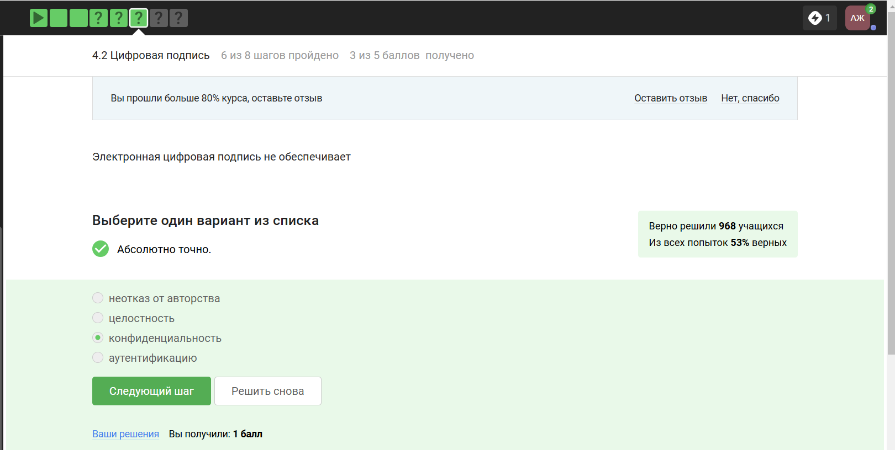
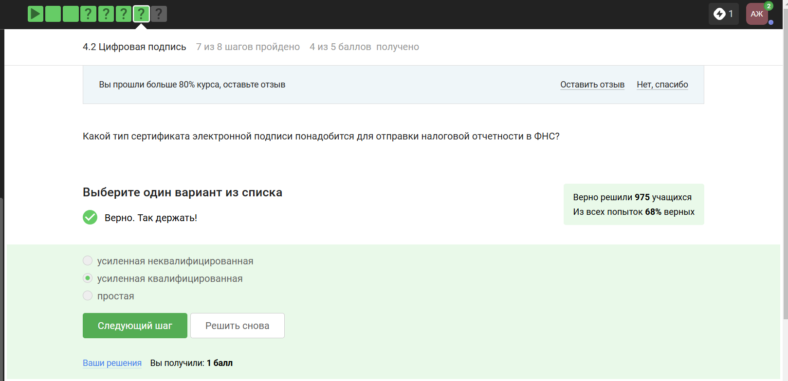
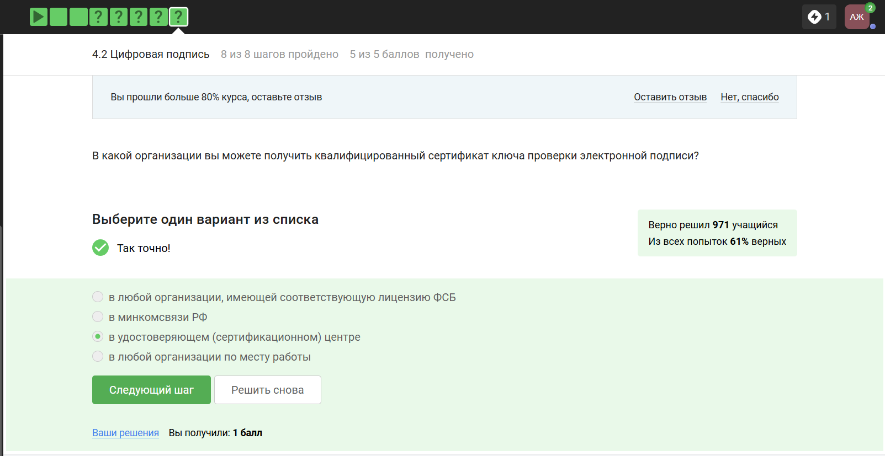
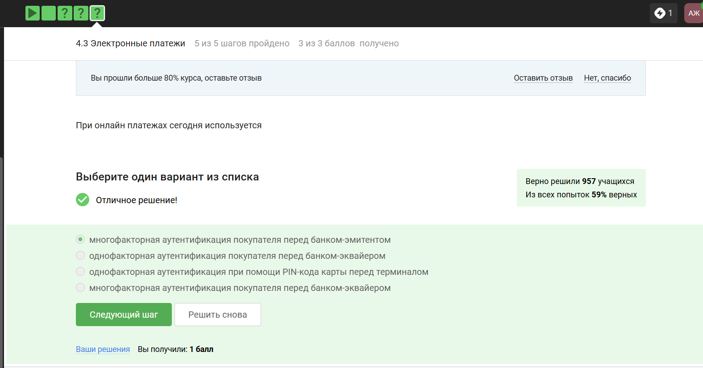
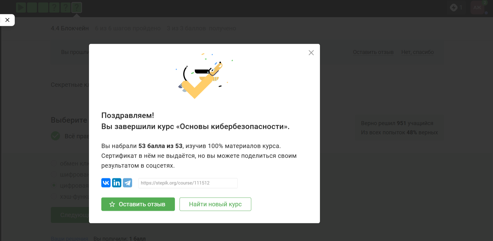
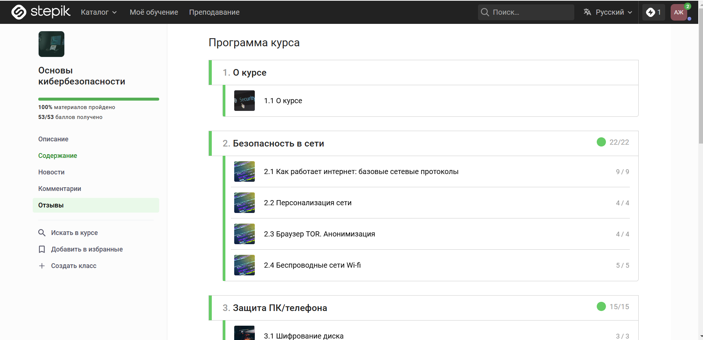

---
## Front matter
title: "Отчёт: Внешний курс"
subtitle: "Раздел 3. Криптография на практике"
author: "Жукова Арина Александровна"

## Generic otions
lang: ru-RU
toc-title: "Содержание"

## Bibliography
bibliography: bib/cite.bib
csl: pandoc/csl/gost-r-7-0-5-2008-numeric.csl

## Pdf output format
toc: true # Table of contents
toc-depth: 2
lof: true # List of figures
lot: true # List of tables
fontsize: 12pt
linestretch: 1.5
papersize: a4
documentclass: scrreprt
## I18n polyglossia
polyglossia-lang:
  name: russian
  options:
	- spelling=modern
	- babelshorthands=true
polyglossia-otherlangs:
  name: english
## I18n babel
babel-lang: russian
babel-otherlangs: english
## Fonts
mainfont: IBM Plex Serif
romanfont: IBM Plex Serif
sansfont: IBM Plex Sans
monofont: IBM Plex Mono
mathfont: STIX Two Math
mainfontoptions: Ligatures=Common,Ligatures=TeX,Scale=0.94
romanfontoptions: Ligatures=Common,Ligatures=TeX,Scale=0.94
sansfontoptions: Ligatures=Common,Ligatures=TeX,Scale=MatchLowercase,Scale=0.94
monofontoptions: Scale=MatchLowercase,Scale=0.94,FakeStretch=0.9
mathfontoptions:
## Biblatex
biblatex: true
biblio-style: "gost-numeric"
biblatexoptions:
  - parentracker=true
  - backend=biber
  - hyperref=auto
  - language=auto
  - autolang=other*
  - citestyle=gost-numeric
## Pandoc-crossref LaTeX customization
figureTitle: "Рис."
tableTitle: "Таблица"
listingTitle: "Листинг"
lofTitle: "Список иллюстраций"
lotTitle: "Список таблиц"
lolTitle: "Листинги"
## Misc options
indent: true
header-includes:
  - \usepackage{indentfirst}
  - \usepackage{float} # keep figures where there are in the text
  - \floatplacement{figure}{H} # keep figures where there are in the text
---

#  Цель курса

Заложить основы для понимания основных принципов работы в сети 

# Задачи 

- понять, как работает Интернет, и какие у него “слабые” места

- уяснить, почему 1245YOURNAME -- плохой пароль

- научиться отличать шифрование от электронной подписи

- узнать, как работают электронные платежи

# Теоретическое введение 

Криптографические примитивы:

* Симметричное шифрование использует общий секретный ключ для шифрования и дешифрования данных. Включает генерацию ключа, функцию шифрования и функцию дешифрования.
* Аутентификация — процесс подтверждения подлинности участников коммуникации.
* Цифровая подпись в асимметричной криптографии используется для подтверждения авторства и целостности данных. У каждой стороны есть пара ключей: открытый и секретный.
* Хэш-функция преобразует входные данные в фиксированную строку. Применяется для хранения паролей, подтверждения целостности данных и в блокчейне. Важное свойство — стойкость к коллизиям и сложность обращения функции.

Криптография делится на:

* Симметричную — с использованием общих секретных ключей.
* Асимметричную (с открытым ключом) — с парой ключей у каждой стороны.
Цифровая подпись обеспечивает целостность, аутентификацию и неотказуемость сообщения.

Области применения цифровой подписи:

1. Обновление софта. Разработчики подписывают программный код с помощью секретного ключа. Пользователи проверяют подпись перед установкой обновления.
2. Сертификаты. Удостоверяющие центры связывают публичные ключи с физическими лицами. Пользователи могут проверить подлинность сертификатов и публичных ключей.

Пример: пользователь Алиса получает сертификат от удостоверяющего центра, который подтверждает её публичный ключ. Другие пользователи могут проверить сертификат и установить аутентифицированный канал с Алисой.
Блокчейн — это система, основанная на технологии распределённого реестра, где данные хранятся в виде последовательности блоков, содержащих транзакции.

Криптовалюта — разновидность цифровых денег, построенных на основе технологии блокчейн. Для их корректной работы используются криптографические примитивы.

Майнеры — участники блокчейна, которые создают новые блоки, добавляя их в сеть.

Консенсус в блокчейне — это публичная структура данных (ledger), где хранится история всех переводов. Свойства консенсуса: постоянство, согласованность данных среди участников, живучесть (возможность добавления новых транзакций) и открытость (возможность участия в блокчейне для любого человека).

Транзакция — это перевод денег от одного человека к другому. Транзакции формируются любыми участниками, а блоки — майнерами.

# Прохождение раздела криптография на практике

##  **Введение в криптографию**

**№1**

**Формулировка задания:**  *В асимметричных криптографических примитивах:*

**Варианты ответа:**

- [ ] обе стороны имеют пару ключей
- [ ] одна сторона публикует свой секретный ключ, другая - держит его в секрете
- [ ] обе стороны имеют общий секретный ключ
- [x] одна сторона имеет только секретный ключ, а другая – пару из открытого и секретного ключей

**Обоснование ответа:**  
В асимметричной криптографии используется пара ключей:
1. **Открытый ключ** - публикуется и используется для шифрования/проверки подписи
2. **Секретный ключ** - хранится в тайне и используется для расшифровки/создания подписи

{#fig:011 width=70%}

**№2**

**1. Формулировка задания** *Свойства криптографической хэш-функции:*  

**2. Варианты ответа**  

- [x] стойкая к коллизиям  
- [x] фиксированный размер вывода  
- [x] эффективно вычисляется  
- [ ] обеспечивает конфиденциальность захэшированных данных  

{#fig:012 width=70%}

**3. Обоснование ответа**  
Хэш-функции гарантируют целостность данных и устойчивость к коллизиям, но **не шифруют информацию**, поэтому конфиденциальность не обеспечивается.  

**№3**

**1. Формулировка задания**  *К алгоритмам цифровой подписи относятся:*  

**2. Варианты ответа**  

- [x] RSA  
- [x] ECDSA  
- [x] ГОСТ Р 34.10-2012  
- [ ] AES  

{#fig:013 width=70%}

**3. Обоснование ответа**  
RSA, ECDSA и ГОСТ Р 34.10-2012 — стандартные алгоритмы цифровой подписи. AES — алгоритм симметричного шифрования.  

**№4**

**1. Формулировка задания**  *Код аутентификации сообщения (MAC) относится к:*  

**2. Варианты ответа**  

- [x] симметричным примитивам  
- [ ] асимметричным примитивам  

{#fig:014 width=70%}

**3. Обоснование ответа**  
MAC использует **общий секретный ключ** для генерации и проверки кода, что характерно для симметричной криптографии.  

**№5**

**1. Формулировка задания**  *Обмен ключами Диффи-Хеллмана — это:*  

**2. Варианты ответа**  

- [x] асимметричный примитив генерации общего секретного ключа  
- [ ] симметричный примитив генерации общего секретного ключа  

{#fig:015 width=70%}

**3. Обоснование ответа**  
Протокол Диффи-Хеллмана позволяет двум сторонам безопасно сгенерировать общий секретный ключ через незащищённый канал, используя асимметричные методы.  

---

## **Цифровая подпись**  

**№1**

**1. Формулировка задания**  *Протокол электронной цифровой подписи относится к:*  

**2. Варианты ответа**  

- [x] протоколам с публичным (открытым) ключом  
- [ ] протоколам с симметричным ключом  

{#fig:021 width=70%}

**3. Обоснование ответа**  
ЭЦП основана на асимметричной криптографии, где используется пара ключей: секретный (для подписи) и открытый (для проверки).  

**№2**

**1. Формулировка задания** *Алгоритм верификации ЭЦП требует на вход:*  

**2. Варианты ответа**  

- [x] подпись, открытый ключ, сообщение  
- [ ] подпись, секретный ключ  

{#fig:022 width=70%}

**3. Обоснование ответа**  
Для проверки подписи необходимы: сама подпись, открытый ключ отправителя и исходное сообщение.  

**№3**

**1. Формулировка задания**  *Электронная цифровая подпись не обеспечивает:*  

**2. Варианты ответа**  

- [x] конфиденциальность  
- [ ] целостность  

{#fig:023 width=70%}

**3. Обоснование ответа**  
ЭЦП гарантирует аутентификацию, целостность и неотрекаемость, но **не шифрует данные**, поэтому конфиденциальность отсутствует.  

**№4**

**1. Формулировка задания**  *Какой тип сертификата ЭП нужен для отправки отчётности в ФНС?*  

**2. Варианты ответа**  

- [x] усиленная квалифицированная  
- [ ] простая  

{#fig:024 width=70%}

**3. Обоснование ответа**  
Для взаимодействия с государственными органами РФ требуется **усиленная квалифицированная ЭП**, соответствующая требованиям ФЗ-63.  

**№5**

**1. Формулировка задания**  *В какой организации можно получить квалифицированный сертификат ключа проверки ЭП?*  

**2. Варианты ответа**  

- [x] в удостоверяющем (сертификационном) центре  
- [ ] в Минкомсвязи РФ  
- [ ] в любой организации с лицензией ФСБ  

{#fig:025 width=70%}

**3. Обоснование ответа**  
Квалифицированные сертификаты выдаются только **аккредитованными удостоверяющими центрами**, регулируемыми законодательством РФ.  

---

## **Электронные платежи**  

**№1**

**1. Формулировка задания**  *Выберите все платежные системы:*  

**2. Варианты ответа**  

- [x] MasterCard  
- [x] MMP  
- [ ] Bitcoin (криптовалюта, а не платежная система)  

{#fig:031 width=70%}

**3. Обоснование ответа**  
MasterCard и MMP — традиционные платежные системы. Bitcoin относится к криптовалютам.  

**№2**

**1. Формулировка задания**  *Пример многофакторной аутентификации:*  

**2. Варианты ответа**  

- [x] комбинация пароля + код в SMS  
- [x] комбинация SMS + отпечаток пальца  
- [x] комбинация PIN + пароль  

{#fig:032 width=70%}

**3. Обоснование ответа**  
Многофакторная аутентификация требует **не менее двух независимых факторов** (знание, владение, биометрия).  

**№3**

**1. Формулировка задания**  *При онлайн-платежах сегодня используется:*  

**2. Варианты ответа**  

- [x] многофакторная аутентификация покупателя перед банком-эмитентом  
- [ ] однофакторная аутентификация  

{#fig:033 width=70%}

**3. Обоснование ответа**  
Для повышения безопасности банки используют многофакторную аутентификацию (например, пароль + SMS).  

---

## **Блокчейн**  

**№1**

**1. Формулировка задания**  *Какое свойство хэш-функции используется в доказательстве работы (PoW)?*  

**2. Варианты ответа**  

- [x] сложность нахождения прообраза  
- [ ] фиксированная длина выходных данных  

{#fig:041 width=70%}

**3. Обоснование ответа**  
PoW основан на вычислительной сложности подбора входных данных для получения заданного хэша.  

**№2**

**1. Формулировка задания**  *Свойства консенсуса в блокчейне:*  

**2. Варианты ответа**  

- [x] консенсус  
- [x] постоянство  
- [x] живучесть  
- [x] открытость  

{#fig:042 width=70%}

**3. Обоснование ответа**  
Консенсус обеспечивает согласованность данных, постоянство — неизменность, живучесть — устойчивость к сбоям, открытость — прозрачность.  

**№3**

**1. Формулировка задания**  *Секретные ключи участников блокчейна:*  

**2. Варианты ответа**  

- [x] цифровая подпись  
- [ ] шифрование  

{#fig:043 width=70%}

**3. Обоснование ответа**  
Участники используют **секретные ключи цифровой подписи** для подтверждения транзакций.  

---

# Сертификат 

{#fig:0 width=70%}

{#fig:1 width=70%}

# Вывод

По прохождению данного раздела курса были изучены цифровые подписи, безопасность платежей и блокчейн. Наиболее сложными были задания на идентификацию платежных систем и свойства консенсуса. 

# Список литературы{.unnumbered}

::: {#refs}
::: 
