---
## Front matter
title: "Лабораторная работа № 1"
subtitle: "Установка и конфигурация операционной системы на виртуальную машину"
author: "Жукова Арина Александровна"

## Generic otions
lang: ru-RU
toc-title: "Содержание"

## Bibliography
bibliography: bib/cite.bib
csl: pandoc/csl/gost-r-7-0-5-2008-numeric.csl

## Pdf output format
toc: true # Table of contents
toc-depth: 2
lof: true # List of figures
lot: true # List of tables
fontsize: 12pt
linestretch: 1.5
papersize: a4
documentclass: scrreprt
## I18n polyglossia
polyglossia-lang:
  name: russian
  options:
	- spelling=modern
	- babelshorthands=true
polyglossia-otherlangs:
  name: english
## I18n babel
babel-lang: russian
babel-otherlangs: english
## Fonts
mainfont: IBM Plex Serif
romanfont: IBM Plex Serif
sansfont: IBM Plex Sans
monofont: IBM Plex Mono
mathfont: STIX Two Math
mainfontoptions: Ligatures=Common,Ligatures=TeX,Scale=0.94
romanfontoptions: Ligatures=Common,Ligatures=TeX,Scale=0.94
sansfontoptions: Ligatures=Common,Ligatures=TeX,Scale=MatchLowercase,Scale=0.94
monofontoptions: Scale=MatchLowercase,Scale=0.94,FakeStretch=0.9
mathfontoptions:
## Biblatex
biblatex: true
biblio-style: "gost-numeric"
biblatexoptions:
  - parentracker=true
  - backend=biber
  - hyperref=auto
  - language=auto
  - autolang=other*
  - citestyle=gost-numeric
## Pandoc-crossref LaTeX customization
figureTitle: "Рис."
tableTitle: "Таблица"
listingTitle: "Листинг"
lofTitle: "Список иллюстраций"
lotTitle: "Список таблиц"
lolTitle: "Листинги"
## Misc options
indent: true
header-includes:
  - \usepackage{indentfirst}
  - \usepackage{float} # keep figures where there are in the text
  - \floatplacement{figure}{H} # keep figures where there are in the text
---

# Цель работы

Целью данной работы является приобретение практических навыков установки операционной системы на виртуальную машину, настройки минимально необходимых для дальнейшей работы сервисов.

# Выполнение лабораторной работы

## Установка и настройка виртуальной машины

1. **Создание новой виртуальной машины**: Я открываю VirtualBox и выбираю "Машина" -> "Создать". 

2. **Указание параметров виртуальной машины**: Вводя имя виртуальной машины, я включаю свой логин в дисплейном классе. Выбираю тип операционной системы — Linux и версию — RedHat (64-bit). Затем указываю путь к iso-образу устанавливаемого дистрибутива и отмечаю опцию "Пропустить автоматическую установку".

3. **Настройка ресурсов виртуальной машины**: Указываю размер основной памяти — 2048 МБ (или больше, если это позволяет мой компьютер) и выбираю количество процессоров (например, 1 или 2).

4. **Задание размера виртуального жёсткого диска**: Я устанавливаю размер виртуального жёсткого диска — 40 ГБ  (рис. [-@fig:001]).

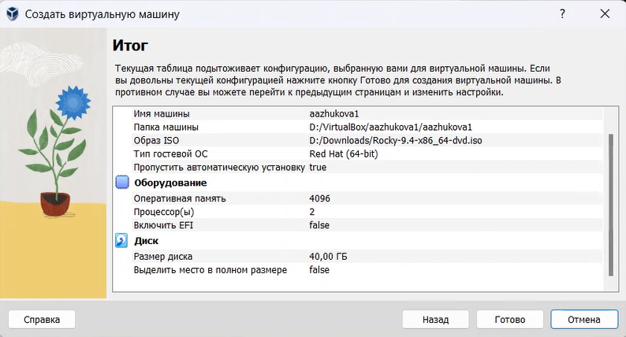{#fig:001 width=70%}

5. **Запуск виртуальной машины**: Запускаю виртуальную машину и в меню переключаюсь на строку "Install Rocky Linux версия", нажимаю Enter для начала установки образа ОС.

6. **Выбор языка интерфейса**: В окне "Добро пожаловать в Rocky Linux..." я выбираю English в качестве языка интерфейса и перехожу к настройкам установки (рис. [-@fig:002]).

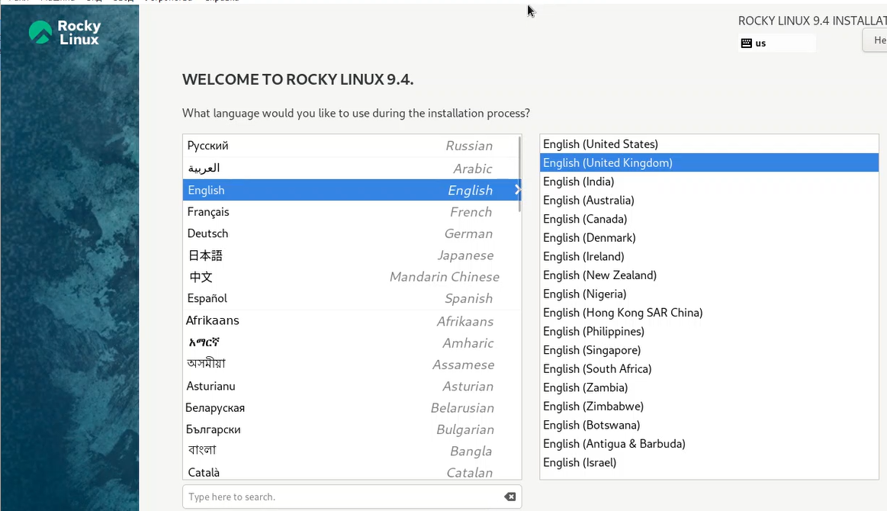{#fig:002 width=70%}

7. **Настройки установки**: Я корректирую часовой пояс и раскладку клавиатуры, добавляя русский язык, но в качестве языка по умолчанию устанавливаю английский. Задаю комбинацию клавиш для переключения между раскладками клавиатуры, например, Alt + Shift, и поддерживаю русский язык в ОС.

8. **Выбор программного обеспечения**: В разделе выбора программ я указываю базовое окружение Server with GUI и дополнение Development Tools.

9. **Отключение KDUMP**: Я отключаю KDUMP и оставляю место установки ОС без изменений.

10. **Настройка сетевого соединения**: Включаю сетевое соединение и в качестве имени узла указываю user.localdomain, заменяя "user" на своё имя пользователя согласно соглашению об именовании (рис. [-@fig:003]).

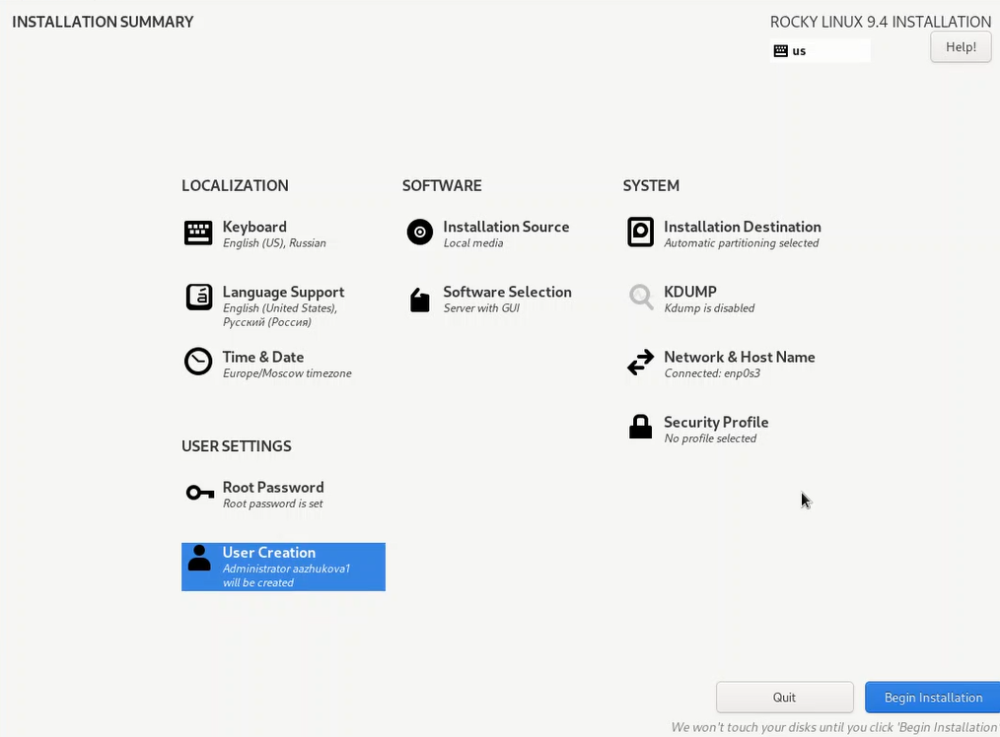{#fig:003 width=70%}

11. **Установка пароля для root**: Я устанавливаю пароль для учетной записи root и разрешаю ввод пароля при использовании SSH (рис. [-@fig:004]).

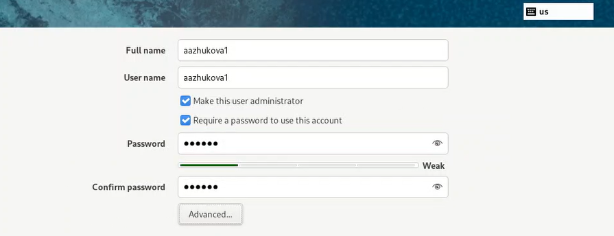{#fig:004 width=70%}

12. **Создание локального пользователя**: Затем я задаю локального пользователя с правами администратора и устанавливаю для него пароль. Если сведения о создании локального пользователя не видны, я перемещаюсь к этим настройкам с помощью клавиш Tab и Enter после задания пароля для root.

13. **Начало установки**: После задания необходимых параметров я нажимаю на "Begin Installation" для начала установки образа системы.

14. **Перезагрузка виртуальной машины**: После завершения установки я корректно перезагружаю виртуальную машину.

15. **Вход в систему**: Я вхожу в ОС под заданной учётной записью, после чего в меню Устройства подключаю образ диска дополнений гостевой ОС. При необходимости я ввожу пароль пользователя root.

16. **Установка дополнений**: После загрузки дополнений я нажимаю Return или Enter и корректно перезагружаю виртуальную машину (рис. [-@fig:005]).

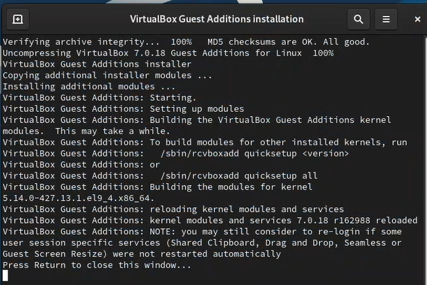{#fig:005 width=70%}

17. **Корректная перезагрузка**: После завершения установки дополнений я перезагружаю операционную систему на виртуальной машине.

## Домашнее задание

1. **Загрузка графического окружения**: Я жду загрузки графического окружения и открываю терминал. Выполняю команду для анализа последовательности загрузки системы:
   ```bash
   dmesg | less
   ```
   Также могу использовать поиск с помощью grep, например:
   ```bash
   dmesg | grep -i "то, что ищем"
   ```

2. **Получение информации**:
   - Версия ядра Linux (Linux version) (рис. [-@fig:011]).

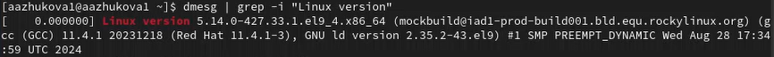{#fig:011 width=70%}

   - Частота процессора (Detected Mhz processor) (рис. [-@fig:012]).

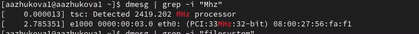{#fig:012 width=70%}

   - Модель процессора (CPU0) (рис. [-@fig:013]).

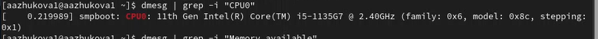{#fig:013 width=70%}

   - Объем доступной оперативной памяти (Memory available) (рис. [-@fig:014]).

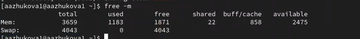{#fig:014 width=70%}

   - Тип обнаруженного гипервизора (Hypervisor detected) (рис. [-@fig:015]).

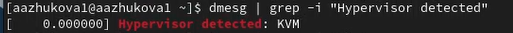{#fig:015 width=70%}

   - Тип файловой системы корневого раздела (рис. [-@fig:016]).

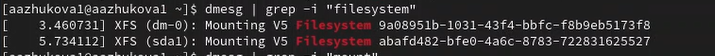{#fig:016 width=70%}

   - Последовательность монтирования файловых систем (рис. [-@fig:017]).

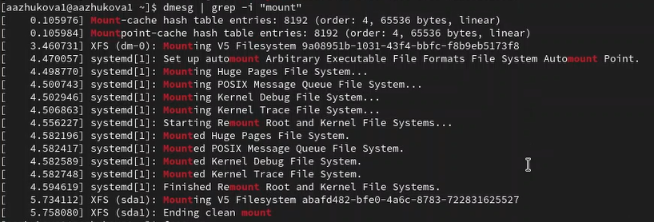{#fig:017 width=70%}

# Контрольные вопросы

1. Какую информацию содержит учётная запись пользователя?

Учетная запись пользователя в Linux содержит следующую информацию:

•   Имя пользователя (Username): Уникальное имя, используемое для входа в систему.
•   Идентификатор пользователя (UID): Уникальный числовой идентификатор, который система использует для идентификации пользователя.
•   Группа пользователя (GID): Числовой идентификатор основной группы, к которой принадлежит пользователь.
•   Дополнительные группы (Supplementary Groups): Список числовых идентификаторов дополнительных групп, в которые входит пользователь.
•   Домашний каталог (Home Directory): Путь к каталогу, который является личным пространством пользователя.
•   Оболочка (Shell): Путь к исполняемому файлу, который является командной оболочкой пользователя (например, bash, zsh).
•   Комментарий (Comment/Gecos): Дополнительная информация о пользователе, такая как полное имя, номер телефона и т.д.
•   Пароль (Password): Зашифрованный пароль пользователя (в современных системах хранится в shadow-файле).

Эта информация хранится в файлах /etc/passwd (для основной информации о пользователе) и /etc/shadow (для зашифрованного пароля).

2. Укажите команды терминала и приведите примеры:

•   Для получения справки по команде:
    *   man <команда>: Отображает подробную справку в формате manual page.
        *   Пример: man ls (показывает справку по команде ls)
    *   <команда> --help: Отображает краткую справку с опциями команды.
        *   Пример: ls --help (показывает краткую справку по команде ls)
    *   help <команда>: (Работает только для встроенных команд оболочки, например, cd).
        *   Пример: help cd (показывает справку по команде cd)

•   Для перемещения по файловой системе:
    *   cd <путь>: Переход в указанный каталог.
        *   Пример: cd /home/user/Documents (переход в каталог Documents в домашнем каталоге пользователя)
    *   cd: Переход в домашний каталог.
    *   cd ..: Переход на один уровень вверх.
    *   cd -: Переход в предыдущий каталог.

•   Для просмотра содержимого каталога:
    *   ls: Вывод списка файлов и подкаталогов в текущем каталоге.
        *   Пример: ls -l (вывод списка в подробном формате с правами доступа, владельцем, размером и датой изменения).
        *   Пример: ls -a (вывод всех файлов, включая скрытые файлы, начинающиеся с точки).
        *   Пример: ls -lh (вывод размеров файлов в человекочитаемом формате, например, KB, MB, GB).
    *   tree:  Вывод содержимого каталога в виде дерева. (Может потребоваться установка: sudo apt install tree или sudo yum install tree).
        *   Пример: tree (вывод содержимого текущего каталога в виде дерева).
        *   Пример: tree -L 2 (вывод дерева только на два уровня глубины).

•   Для определения объёма каталога:
    *   du -sh <каталог>: Вывод суммарного объема каталога в человекочитаемом формате.
        *   Пример: du -sh /home/user/Downloads (показывает размер каталога Downloads).
    *   du -h <каталог>:  Показывает размер каждого файла и подкаталога внутри указанного каталога.
        *   Пример: du -h /var/log (показывает размер каждого файла в каталоге логов).

•   Для создания / удаления каталогов / файлов:
    *   mkdir <каталог>: Создание каталога.
        *   Пример: mkdir NewDirectory (создает каталог с именем NewDirectory в текущем каталоге).
    *   rmdir <каталог>: Удаление пустого каталога.
        *   Пример: rmdir EmptyDirectory (удаляет каталог EmptyDirectory, если он пуст).
    *   rm -r <каталог>: Удаление каталога с содержимым (рекурсивно).  Будьте осторожны!
        *   Пример: rm -r ImportantDirectory (удаляет каталог ImportantDirectory и все файлы и подкаталоги внутри него).
    *   touch <файл>: Создание пустого файла.
        *   Пример: touch new_file.txt (создает пустой файл с именем new_file.txt).
    *   rm <файл>: Удаление файла.
        *   Пример: rm old_file.txt (удаляет файл с именем old_file.txt).

•   Для задания определённых прав на файл / каталог:
    *   chmod <права> <файл/каталог>: Изменение прав доступа к файлу или каталогу.  Права можно задавать в символьном или восьмеричном формате.
        *   Пример (восьмеричный формат): chmod 755 script.sh (дает права владельцу на чтение, запись и выполнение, а группе и остальным - только на чтение и выполнение).
        *   Пример (символьный формат): chmod u+x,go+r script.sh (добавляет владельцу право на выполнение, а группе и остальным - право на чтение).
        *   7 соответствует rwx (чтение, запись, выполнение).
        *   6 соответствует rw- (чтение, запись).
        *   5 соответствует r-x (чтение, выполнение).
        *   4 соответствует r-- (только чтение).

•   Для просмотра истории команд:
    *   history: Отображает список ранее введенных команд.
    *   !n: Выполнение n-ной команды из истории (где n - номер команды).
    *   !!: Выполнение последней команды.
    *   !<начало_команды>: Выполнение последней команды, начинающейся с указанного префикса.
        *   Пример: !ls (выполнит последнюю команду, которая начиналась с "ls").
    *   Ctrl+R: Поиск по истории команд (интерактивный поиск).

3. Что такое файловая система? Приведите примеры с краткой характеристикой.

Файловая система (File System) - это метод организации и хранения данных на запоминающем устройстве (например, жесткий диск, SSD, USB-накопитель). Она определяет, как файлы и каталоги (папки) структурированы, и как операционная система взаимодействует с этими данными.  Файловая система обеспечивает логическую структуру, позволяющую операционной системе находить и управлять файлами.

Примеры файловых систем:

•   ext4 (Fourth Extended Filesystem):  Наиболее распространенная файловая система в современных дистрибутивах Linux. Она является эволюцией ext3 и ext2, предлагая улучшенную производительность, надежность и поддержку больших файлов и разделов.
    *   *Характеристика:* Журналируемая файловая система, поддержка больших файлов, дефрагментация, расширенные атрибуты.
•   XFS:  Высокопроизводительная журналируемая файловая система, изначально разработанная Silicon Graphics (SGI).  Хорошо подходит для работы с большими файлами и системами с высокой нагрузкой ввода/вывода.
    *   *Характеристика:* Журналируемая, оптимизирована для больших файлов, масштабируемость, высокая производительность.
•   Btrfs (B-tree file system):  Современная файловая система, разработанная с учетом современных требований. Предлагает множество расширенных функций, таких как снимки (snapshots), копирование при записи (copy-on-write), сжатие и RAID.
    *   *Характеристика:* Копирование при записи, снимки, встроенная поддержка RAID, онлайн-дефрагментация, сжатие.
•   FAT32 (File Allocation Table 32-bit):  Устаревшая файловая система, широко используемая на USB-накопителях и в переносных устройствах.  Имеет ограничение на размер файла (4 ГБ).
    *   *Характеристика:*  Простота, совместимость, ограничение на размер файла.
•   NTFS (New Technology File System):  Стандартная файловая система для Windows NT-семейства операционных систем.  Поддерживает разграничение прав доступа, шифрование и другие расширенные функции.  Linux может читать и записывать данные на разделы NTFS, но поддержка записи может быть менее стабильной, чем на нативных файловых системах Linux.
    *   *Характеристика:* Журналируемая, поддержка прав доступа, шифрование, сжатие.

4. Как посмотреть, какие файловые системы подмонтированы в ОС?

Для просмотра информации о подмонтированных файловых системах можно использовать следующие команды:

•   mount: Отображает список всех подмонтированных файловых систем и точек монтирования.
•   df -h: Отображает информацию о занятом и свободном пространстве на дисках, включая

ChatGPT4 | Midjourney, [22.02.2025 19:17]
подмонтированные файловые системы, в человекочитаемом формате.
•   lsblk:  Выводит список блочных устройств (дисков, разделов) и информацию о точках монтирования.

5. Как удалить зависший процесс?

Чтобы удалить зависший процесс, нужно выполнить следующие шаги:

1.  Найти PID (Process ID) процесса:
    *   ps aux | grep <имя_процесса>: Отображает список всех процессов, а затем фильтрует его, чтобы найти процесс с заданным именем.  Замените <имя_процесса> на часть имени зависшего процесса.  Например: ps aux | grep firefox.
    *   top или htop: Интерактивные мониторы процессов, которые показывают процессы, использующие больше всего ресурсов.  Используйте top или htop, чтобы найти процесс, который не отвечает. (htop обычно нужно установить отдельно: sudo apt install htop или sudo yum install htop).

2.  Убить процесс:
    *   kill <PID>:  Отправляет процессу сигнал SIGTERM (сигнал завершения).  Это "мягкий" способ остановить процесс, позволяющий ему корректно завершить работу и сохранить данные.
        *   Пример: kill 1234 (убивает процесс с PID 1234).
    *   kill -9 <PID>:  Отправляет процессу сигнал SIGKILL (сигнал немедленного завершения).  Это "жесткий" способ остановить процесс, который не позволяет ему корректно завершить работу.  Используйте его только в крайнем случае, если kill <PID> не работает. Использование kill -9 может привести к потере данных.
        *   Пример: kill -9 1234 (принудительно убивает процесс с PID 1234).
    *   pkill <имя_процесса>:  Посылает сигнал всем процессам, совпадающим по имени.  Используйте с осторожностью, чтобы не убить нежелательные процессы.
        *   Пример: pkill firefox (убивает все процессы с именем firefox).
    *   xkill: (Графическая утилита)  Позволяет выбрать окно и убить процесс, который его создал.  После запуска xkill, курсор мыши меняется на крестик.  Кликните на окно зависшей программы, чтобы убить процесс.

::: {#refs}
:::
