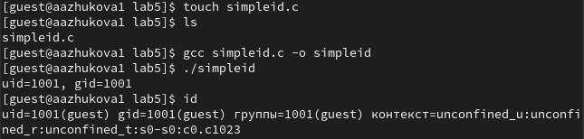
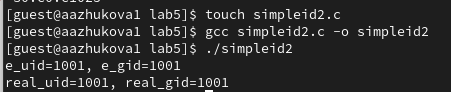
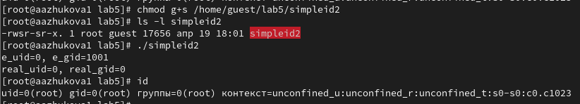
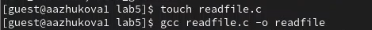
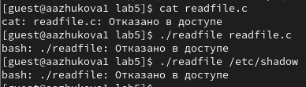
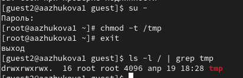
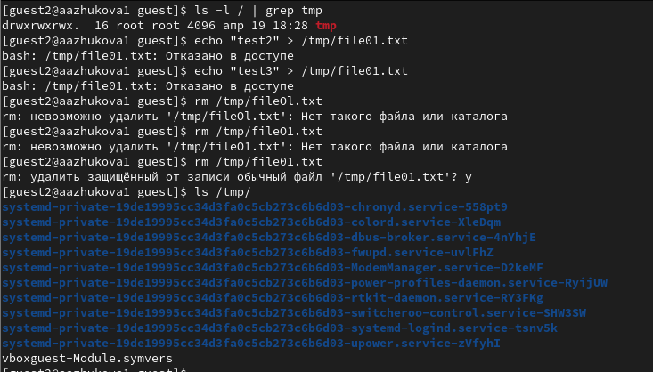
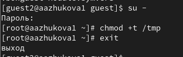

---
## Front matter
lang: ru-RU
title: Лабораторная работа №5
subtitle: Дискреционное разграничение прав в Linux. Исследование влияния дополнительных атрибутов

author:
  - Жукова А. А.
institute:
  - Российский университет дружбы народов, Москва, Россия
date: 19 апреля 2025

## i18n babel
babel-lang: russian
babel-otherlangs: english

## Formatting pdf
toc: false
toc-title: Содержание
slide_level: 2
aspectratio: 169
section-titles: true
theme: metropolis
header-includes:
 - \metroset{progressbar=frametitle,sectionpage=progressbar,numbering=fraction}
---

# Информация

## Докладчик

:::::::::::::: {.columns align=center}
::: {.column width="70%"}

  * Жукова Арина Александровна
  * Студент бакалавриата, 2 курс
  * группа: НПИбд-03-23
  * Российский университет дружбы народов
  * [1132239120@rudn.ru](mailto:1132239120@rudn.ru)

:::
::: {.column width="30%"}

:::
::::::::::::::

# Вводная часть

## Цель лабораторной работы

- Изучить механизмы изменения идентификаторов, применения SetUID- и Sticky-битов. 
- Получить практические навыки работы в консоли с дополнительными атрибутами. 
- Рассмотреть работу механизма смены идентификатора процессов пользователей, а также влияние 
бита Sticky на запись и удаление файлов.

# Ход выполнения лабораторной работы

# Подготовка лабораторного стенда

{ #fig:001 width=100% height=100% }

# Создание программы

## Создание программы simpleid.c

{ #fig:002 width=100% height=100% }

## Усложнение программы и сохранение её как simpleid2.c

{ #fig:006 width=100% height=100% }

## Выполение команд от имени суперпользователя

{ #fig:008 width=100% height=100% }

## Временное повышение своих права с помощью su

От имени суперпользователя выполнил команды “sudo chown root:guest /home/guest/simpleid2” и
“sudo chmod u+s /home/guest/simpleid2”, затем выполнил проверку правильности установки новых атрибутов
и смены владельца файла simpleid2 командой “sudo ls -l /home/guest/simpleid2”. Этими
командами была произведена смена пользователя файла на root и установлен SetUID-бит.

## Повторение действий для SetGID-бита

{ #fig:011 width=100% height=100% }

## Создание программы readfile.c

{ #fig:012 width=100% height=100% }

## Работа с readfile.c и readfile

{ #fig:014 width=100% height=100% }

## Проверка

{ #fig:015 width=100% height=100% }

# Исследование Sticky-бита

## Проверка атрибута Sticky на директории /tmp

{ #fig:016 width=100% height=100% }

## Попытка чтения и дозаписи файла от пользователя guest2

{ #fig:019 width=100% height=100% }

## Проверка от пользователя guest2, что атрибута t у директории /tmp нет

{ #fig:025 width=100% height=100% }

## Повторение предыдущих шагов

{ #fig:027 width=100% height=100% }

## Повышение прав до суперпользователя и возвращение атрибута t на директорию /tmp

{ #fig:028 width=100% height=100% }

# Вывод

## Вывод

В ходе выполнения лабораторной работы были изучены механизмы изменения идентификаторов и применения SetUID- и
Sticky-битов. Получены практические навыки работы в консоли с дополнительными атрибутами, а также была рассмотрена
работа механизма смены идентификатора процессов пользователей и влияние бита Sticky на запись и удаление файлов.

# Список литературы. Библиография

[[1] Дополнительные атрибуты: https://tokmakov.msk.ru/blog/item/141

[2] Компилятор GSS: http://parallel.imm.uran.ru/freesoft/make/instrum.html
