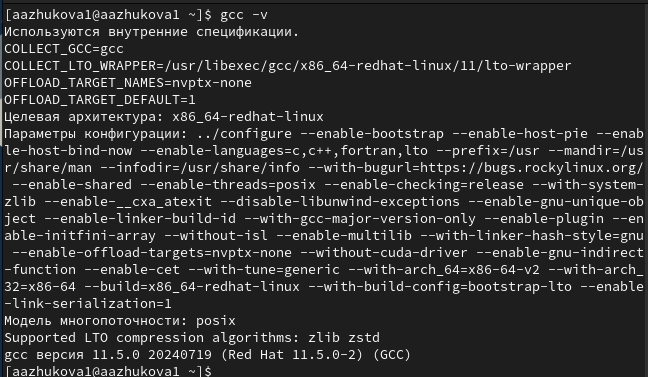
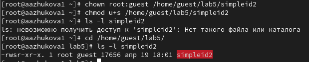
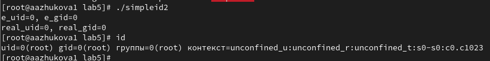
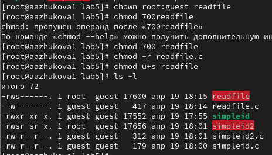
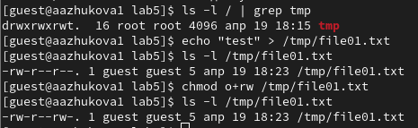
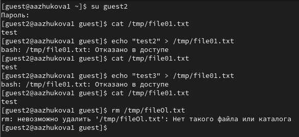

---
## Front matter
title: "Отчёт по лабораторной работе №5. Информационная безопасность"
subtitle: "Дискреционное разграничение прав в Linux. Исследование влияния дополнительных атрибутов"
author: "Выполнила: Жукова Арина Алексанндровна, НПИбд-03-23, 1132239120"

## Generic otions
lang: ru-RU
toc-title: "Содержание"

## Bibliography
bibliography: bib/cite.bib
csl: pandoc/csl/gost-r-7-0-5-2008-numeric.csl

## Pdf output format
toc: true # Table of contents
toc-depth: 2
lof: true # List of figures
fontsize: 12pt
linestretch: 1.5
papersize: a4
documentclass: scrreprt
## I18n polyglossia
polyglossia-lang:
  name: russian
  options:
	- spelling=modern
	- babelshorthands=true
polyglossia-otherlangs:
  name: english
## I18n babel
babel-lang: russian
babel-otherlangs: english
## Fonts
mainfont: PT Serif
romanfont: PT Serif
sansfont: PT Sans
monofont: PT Mono
mainfontoptions: Ligatures=TeX
romanfontoptions: Ligatures=TeX
sansfontoptions: Ligatures=TeX,Scale=MatchLowercase
monofontoptions: Scale=MatchLowercase,Scale=0.9
## Biblatex
biblatex: true
biblio-style: "gost-numeric"
biblatexoptions:
  - parentracker=true
  - backend=biber
  - hyperref=auto
  - language=auto
  - autolang=other*
  - citestyle=gost-numeric
## Pandoc-crossref LaTeX customization
figureTitle: "Рис."
tableTitle: "Таблица"
listingTitle: "Листинг"
lofTitle: "Список иллюстраций"
lolTitle: "Листинги"
## Misc options
indent: true
header-includes:
  - \usepackage{indentfirst}
  - \usepackage{float} # keep figures where there are in the text
  - \floatplacement{figure}{H} # keep figures where there are in the text
---

# Цель работы

Изучение механизмов изменения идентификаторов, применения SetUID- и Sticky-битов. Получение практических навыков работы в консоли с дополнительными атрибутами. Рассмотрение работы механизма смены идентификатора процессов пользователей, а также влияние бита Sticky на запись и удаление файлов.

# Выполнение лабораторной работы

## Подготовка лабораторного стенда

Убедимся, что в системе установлен компилятор gcc. После чего отключим систему запретов до очередной перезагрузки системы и выполним проверку

{ #fig:001 width=100% height=100% }

## Создание программы

1. Войдём в систему от имени пользователя guest и создадим программу simpleid.c. Скомплилируем программу и убедимся, что файл программы создан. Затем выполним программу simpleid. Выполним системную программу id и сравним полученный нами результат с данными предыдущего пункта задания.

{ #fig:002 width=100% height=100% }

2. Усложним программу, добавив вывод действительных идентификаторов. После чего получившуюся программу назовём 
simpleid2.c. Скомпилируем и запустим simpleid2.c.

{ #fig:006 width=100% height=100% }

3. От имени суперпользователя выполним команды, выполним проверку правильности установки новых атрибутов и смены владельца файла simpleid2

{ #fig:008 width=100% height=100% }

От имени суперпользователя выполнил команды “sudo chown root:guest /home/guest/simpleid2” и 
“sudo chmod u+s /home/guest/simpleid2”, затем выполнил проверку правильности установки новых атрибутов 
и смены владельца файла simpleid2 командой “sudo ls -l /home/guest/simpleid2”. Этими
командами была произведена смена пользователя файла на root и установлен SetUID-бит.

4. Запустим simpleid2 и id и сравним результаты

{ #fig:010 width=100% height=100% }

5. Теперь проделаем тоже самое относительно SetGID-бита

{ #fig:011 width=100% height=100% }

6. Создадим программу readfile.c, откомпилируем 

{ #fig:012 width=100% height=100% }

7. Сменим владельца у файла readfile.c и изменим права так, чтобы только суперпользователь (root) мог прочитать его, a guest не мог. Затем сменим у программы readfile владельца и установим SetU’D-бит

{ #fig:014 width=100% height=100% }

8. Проверим, что пользователь guest не может прочитать файл readfile.c, может ли программа readfile прочитать файл readfile.c, и может ли программа readfile прочитать файл /etc/shadow? 

{ #fig:015 width=100% height=100% }

## Исследование Sticky-бита

1. Выясним, установлен ли атрибут Sticky на директории /tmp. От имени пользователя guest создадим файл file01.txt в директории /tmp со словом test. Просмотрим атрибуты у только что созданного файла и разрешим чтение и запись для категории пользователей «все остальные»

{ #fig:016 width=100% height=100% }

2. От пользователя guest2 (не являющегося владельцем) попробуем прочитать файл /tmp/file01.txt. От пользователя guest2 попробуем дозаписать в файл. Проверим содержимое файла. От пользователя guest2 попробуем записать в файл /tmp/file01.txt слово test3, стерев при этом всю имеющуюся в файле информацию. Проверим содержимое файла. От пользователя guest2 попробуем удалить файл /tmp/file01.txt

{ #fig:019 width=100% height=100% }

3. Повысим свои права до суперпользователя командой su и выполним после этого команду, снимающую атрибут t (Sticky-бит) с директории /tmp. Покинем режим суперпользователя и от пользователя guest2 проверим, что атрибута t у директории /tmp нет

{ #fig:025 width=100% height=100% }

4. Повторим предыдущие шаги

{ #fig:027 width=100% height=100% }

13. Повысим свои права до суперпользователя и вернём атрибут t на директорию /tmp

{ #fig:028 width=100% height=100% }

# Вывод

В ходе выполнения лабораторной работы были изучены механизмы изменения идентификаторов и применения SetUID- и 
Sticky-битов. Получены практические навыки работы в консоли с дополнительными атрибутами, а также была рассмотрена работа механизма смены идентификатора процессов пользователей и влияние бита Sticky на запись и удаление файлов.

# Список литературы. Библиография

[1] Дополнительные атрибуты: https://tokmakov.msk.ru/blog/item/141

[2] Компилятор GSS: http://parallel.imm.uran.ru/freesoft/make/instrum.html
