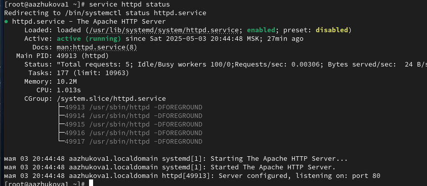
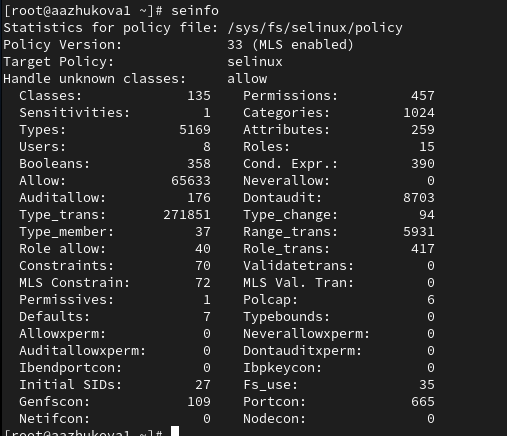
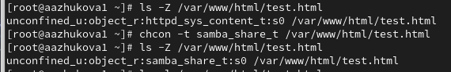
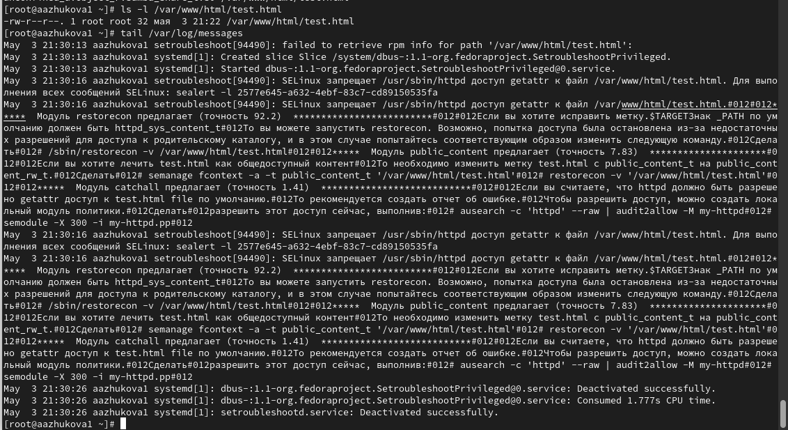
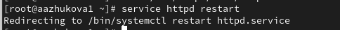
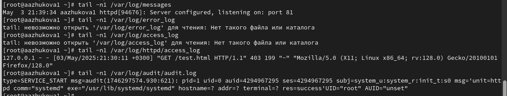
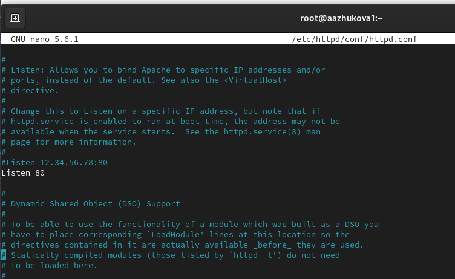
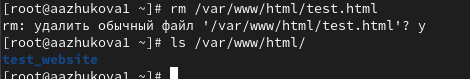

---
## Front matter
lang: ru-RU
title: Лабораторная работа №6
subtitle: Мандатное разграничение прав в Linux
author:
  - Жукова А. А.
institute:
  - Российский университет дружбы народов, Москва, Россия
date: 03 мая 2025

## i18n babel
babel-lang: russian
babel-otherlangs: english

## Formatting pdf
toc: false
toc-title: Содержание
slide_level: 2
aspectratio: 169
section-titles: true
theme: metropolis
header-includes:
 - \metroset{progressbar=frametitle,sectionpage=progressbar,numbering=fraction}
---

# Информация

## Докладчик

:::::::::::::: {.columns align=center}
::: {.column width="70%"}

  * Жукова Арина Александровна
  * Студент бакалавриата, 2 курс
  * группа: НПИбд-03-23
  * Российский университет дружбы народов
  * [1132239120@rudn.ru](mailto:1132239120@rudn.ru)

:::
::: {.column width="30%"}

:::
::::::::::::::

# Вводная часть

## Цель лабораторной работы

- Развить навыки администрирования ОС Linux. 
- Получить первое практическое знакомство с технологией SELinux. 
- Проверить работу SELinux на практике совместно с веб-сервером Apache.

# Ход выполнения лабораторной работы

## Проверка работы в режиме enforcing политики targeted

{ #fig:001 width=80% height=80% }

## Проверка работы веб-сервера

{ #fig:002 width=80% height=80% }

## Нахождение веб-сервера Apache в списке процессов и определение его контекста безопасности

{ #fig:003 width=100% height=100% }

## Просмотр текущего состояния переключателей SELinux

{ #fig:004 width=80% height=80% }

## Просмотр статистики по политике

{ #fig:005 width=80% height=80% }

## Определение типов файлов и поддиректорий

{ #fig:006 width=100% height=100% }

## Определение типов файлов и поддиректорий

{ #fig:007 width=100% height=100% }

## Создание файла с содержанием

{ #fig:008 width=80% height=80% }

## Проверка контекста созданного файла

{ #fig:009 width=100% height=100% }

## Изучение справки и проверка контекста файла

{ #fig:010 width=100% height=100% }

## Изменение контекста файла и проверка

{ #fig:011 width=100% height=100% }

## Попытка получения доступа к файлу через веб-сервер

{ #fig:012 width=100% height=100% }

## Просмотр log-файлов веб-сервера Apache и системного лог-файла

{ #fig:013 width=80% height=80% }

## Попытка запуска веб-сервера Apache на прослушивание ТСР-порта 81

{ #fig:014 width=80% height=80% }

## Перезапуск веб-сервера Apache

{ #fig:015 width=100% height=100% }

## Анализ лог-файлов

{ #fig:016 width=100% height=100% }

## Выполнение команды и проверка списка портов

{ #fig:017 width=100% height=100% }

## Возвращение контекста httpd_sys_cоntent__t к файлу /var/www/html/ test.html и попытка получения доступа к файлу через веб-сервис

{ #fig:018 width=90% height=90% }

## Исправление конфигурационного файла apache

{ #fig:019 width=80% height=80% }

## Удаление привязки http_port_t к 81 порту и проверка

{ #fig:020 width=100% height=100% }

## Удаление файла /var/www/html/test.html

{ #fig:021 width=100% height=100% }

# Вывод

- В ходе выполнения лабораторной работы были развиты навыки администрирования ОС Linux, получено первое практическое 
знакомство с технологией SELinux и проверена работа SELinux на практике совместно с веб-сервером Apache.

# Список литературы. Библиография

[[1] SELinux: https://habr.com/ru/companies/kingservers/articles/209644/

[2] Apache: https://2domains.ru/support/vps-i-servery/shto-takoye-apache
