---
## Front matter
title: "Отчёт по лабораторной работе №6. Информационная безопасность"
subtitle: "Мандатное разграничение прав в Linux"
author: "Жукова Арина Александровна, НПИбд-03-23, 1132239120"

## Generic otions
lang: ru-RU
toc-title: "Содержание"

## Bibliography
bibliography: bib/cite.bib
csl: pandoc/csl/gost-r-7-0-5-2008-numeric.csl

## Pdf output format
toc: true # Table of contents
toc-depth: 2
lof: true # List of figures
fontsize: 12pt
linestretch: 1.5
papersize: a4
documentclass: scrreprt
## I18n polyglossia
polyglossia-lang:
  name: russian
  options:
	- spelling=modern
	- babelshorthands=true
polyglossia-otherlangs:
  name: english
## I18n babel
babel-lang: russian
babel-otherlangs: english
## Fonts
mainfont: PT Serif
romanfont: PT Serif
sansfont: PT Sans
monofont: PT Mono
mainfontoptions: Ligatures=TeX
romanfontoptions: Ligatures=TeX
sansfontoptions: Ligatures=TeX,Scale=MatchLowercase
monofontoptions: Scale=MatchLowercase,Scale=0.9
## Biblatex
biblatex: true
biblio-style: "gost-numeric"
biblatexoptions:
  - parentracker=true
  - backend=biber
  - hyperref=auto
  - language=auto
  - autolang=other*
  - citestyle=gost-numeric
## Pandoc-crossref LaTeX customization
figureTitle: "Рис."
tableTitle: "Таблица"
listingTitle: "Листинг"
lofTitle: "Список иллюстраций"
lolTitle: "Листинги"
## Misc options
indent: true
header-includes:
  - \usepackage{indentfirst}
  - \usepackage{float} # keep figures where there are in the text
  - \floatplacement{figure}{H} # keep figures where there are in the text
---

# Цель работы

Развить навыки администрирования ОС Linux. Получить первое практическое знакомство с технологией SELinux.
Проверить работу SELinx на практике совместно с веб-сервером Apache.

# Выполнение лабораторной работы

Войдём в систему и убедимся, что SELinux работает в режиме enforcing политики targeted с помощью команд getenforce и sestatus

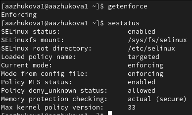{ #fig:001 width=100% height=100% }

Обратимся с помощью браузера к веб-серверу, запущенному на нашем компьютере, и убедимся, что последний работает

{ #fig:002 width=100% height=100% }

Затем найдём веб-сервер Apache в списке процессов и определим его контекст безопасности

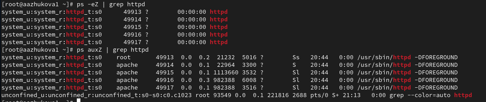{ #fig:003 width=100% height=100% }

Посмотрим текущее состояние переключателей SELinux для Apache

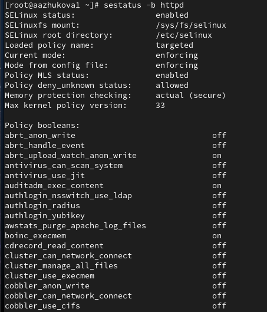{ #fig:004 width=100% height=100% }

Далее посмотрим статистику по политике

{ #fig:005 width=100% height=100% }

Определим тип файлов и поддиректорий, находящихся в директории /var/www

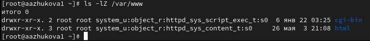{ #fig:006 width=100% height=100% }

Определим тип файлов, находящихся в директории /var/www/html

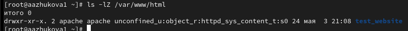{ #fig:007 width=100% height=100% }

Следующим шагом создадим от имени суперпользователя html-файл /var/www/html/test.html с содержанием "test"

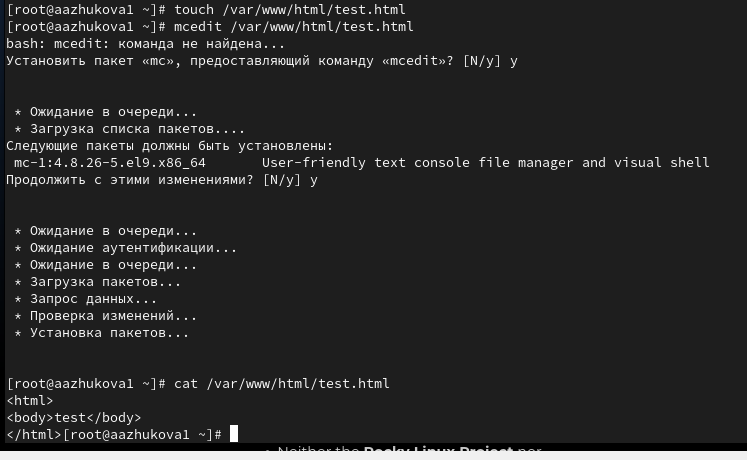{ #fig:008 width=100% height=100% }

Проверим контекст созданного нами файла

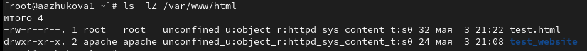{ #fig:009 width=100% height=100% }

Изучим справку man httpd_selinux и выясним, какие контексты файлов определены для httpd. Сопоставим их с типом файла
test.html и проверим контекст файла

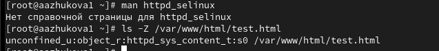{ #fig:010 width=100% height=100% }

Изменим контекст файла /var/www/html/test.html с httpd_sys_content_t на samba_share_t

{ #fig:011 width=100% height=100% }

Попробуем получить доступ к файлу через веб-сервер, введя в браузере адрес http://127.0.0.1/test.html

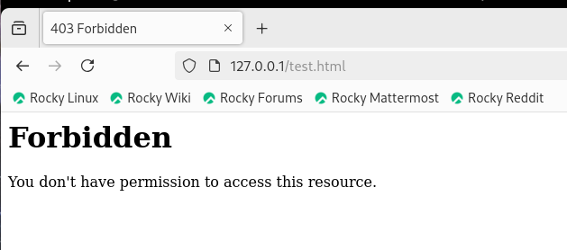{ #fig:012 width=100% height=100% }

Просмотрим log-файлы веб-сервера Apache и системный лог-файл

{ #fig:013 width=100% height=100% }

Попробуем запустить веб-сервер Apache на прослушивание ТСР-порта 81 (а не 80, как рекомендует IANA и прописано в /etc/services)

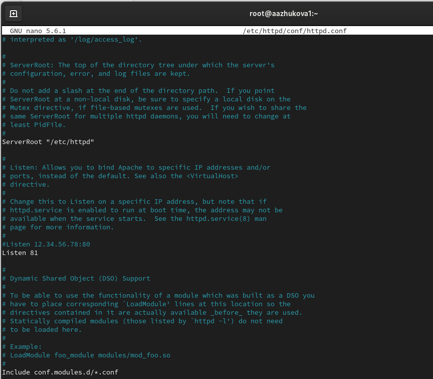{ #fig:014 width=100% height=100% }

Выполним перезапуск веб-сервера Apache

{ #fig:015 width=100% height=100% }

Проанализируем лог-файлы: tail -nl /var/log/messages, /var/log/http/error_log, /var/log/http/access_log и /var/log/audit/audit.log

{ #fig:016 width=100% height=100% }

Выполним команду semanage port -a -t http_port_t -р tcp 81 и после этого проверим список портов

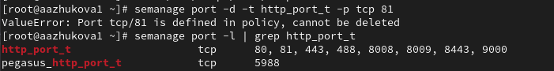{ #fig:017 width=100% height=100% }

Вернём контекст httpd_sys_cоntent__t к файлу /var/www/html/ test.html. После этого попробуем получить доступ к файлу 
через веб-сервер, введя в браузере адрес http://127.0.0.1:81/test.html

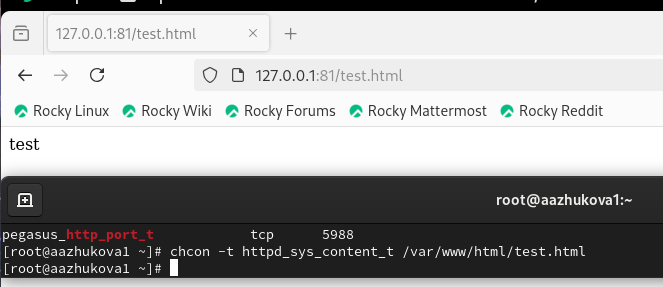{ #fig:018 width=100% height=100% }

Исправим обратно конфигурационный файл apache, вернув Listen 80

{ #fig:019 width=100% height=100% }

Удалим привязку http_port_t к 81 порту

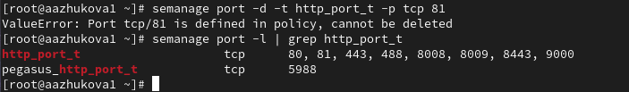{ #fig:020 width=100% height=100% }

Удалим файл /var/www/html/test.html

{ #fig:021 width=100% height=100% }

# Вывод

В ходе выполнения лабораторной работы были развиты навыки администрирования ОС Linux, получено первое практическое 
знакомство с технологией SELinux и проверена работа SELinux на практике совместно с веб-сервером Apache.

# Список литературы. Библиография

[1] SELinux: https://habr.com/ru/companies/kingservers/articles/209644/

[2] Apache: https://2domains.ru/support/vps-i-servery/shto-takoye-apache
