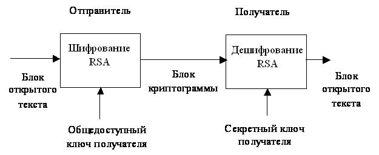

---
## Front matter
lang: ru-RU
title: Электронные цифровые подписи. Механизмы цифровой подписи
subtitle: Основы информационной безопасности
author:
  - Жукова А. А.
institute:
  - Российский университет дружбы народов, Москва, Россия
date: 01 мая 2025

## i18n babel
babel-lang: russian
babel-otherlangs: english

## Formatting pdf
toc: false
toc-title: Содержание
slide_level: 2
aspectratio: 169
section-titles: true
theme: metropolis
header-includes:
 - \metroset{progressbar=frametitle,sectionpage=progressbar,numbering=fraction}
---

# Информация

## Докладчик

:::::::::::::: {.columns align=center}
::: {.column width="70%"}

  * Жукова Арина Александровна
  * Студент бакалавриата, 2 курс
  * группа: НПИбд-03-23
  * Российский университет дружбы народов
  * [1132239120@rudn.ru](mailto:1132239120@rudn.ru)

:::
::: {.column width="30%"}

:::
::::::::::::::

# Вводная часть

## Актуальность темы

С развитием цифровых технологий возрастает потребность в защищенных методах передачи информации. ЭЦП позволяет:

- гарантировать подлинность документа;
- предотвращать мошенничество и подделку данных;
- ускорять бизнес-процессы за счет отказа от бумажного документооборота.

## Объект и предмет исследования

Объект исследования: электронные цифровые подписи и их применение.

Предмет исследования: криптографические механизмы формирования и проверки ЭЦП.

**Практическая значимость работы:**

- при разработке защищенных информационных систем;
- в законодательном регулировании ЭЦП;
- для повышения осведомленности пользователей о безопасности цифровых подписей.

## Цель, гипотеза, задачи исследования

**Цель:** изучить механизмы цифровой подписи и предложить рекомендации по их применению.

**Гипотеза:** современные алгоритмы ЭЦП обеспечивают достаточную защиту, но требуют адаптации к новым угрозам.

**Задачи:**

- Изучить принципы работы ЭЦП.
- Проанализировать криптографические алгоритмы.
- Оценить уязвимости и перспективы развития.

## Материалы и методы исследования

**Теоретическая база:** научные статьи, стандарты (ГОСТ Р 34.10, PKCS), законодательство (ФЗ №63).

**Методы:** криптоанализ, моделирование, сравнительный анализ.

# **Основная часть**  

## **Принципы работы электронной цифровой подписи**  

Электронная цифровая подпись (ЭЦП) – это информация в электронной форме, которая присоединена к другой информации в электронной форме (подписываемой информации) или иным образом связана с такой информацией и которая используется для определения лица, подписывающего информацию.

## Виды ЭЦП:

1. **Простая электронная подпись.** 
2. **Неквалифицированная электронная подпись.** 
3. **Квалифицированная электронная подпись.** 

## Основные функции ЭЦП:

- **Аутентификация** – подтверждение авторства документа.
- **Целостность** – гарантия отсутствия изменений после подписания.
- **Неотрекаемость** – невозможность отказа от подписи.

## **Криптографические основы ЭЦП**  

ЭЦП строится на асимметричной криптографии, где используются: 

- **Закрытый ключ** (приватный)
- **Открытый ключ** (публичный)

## Процесс формирования и проверки подписи: 

1. **Формирование подписи**:

   - Документ хешируется (например, SHA-256).
   - Хеш подписывается закрытым ключом (алгоритмы RSA, ECDSA и др.).   
   - Подпись прикрепляется к документу.
   
2. **Проверка подписи**:

   - Получатель вычисляет хеш документа.
   - Расшифровывает подпись открытым ключом. 
   - Сравнивает полученный хеш с вычисленным. 

## **Основные алгоритмы цифровой подписи**  

**RSA (Rivest-Shamir-Adleman)** - криптографический алгоритм с открытым ключом, который используется для безопасной передачи данных и создания цифровых подписей

## **Основные алгоритмы цифровой подписи**  

**ECDSA (Elliptic Curve Digital Signature Algorithm)** - использует эллиптические кривые (ECC), что позволяет уменьшить длину ключа (256–521 бит). 

- **Преимущества**:  

  - Высокая скорость работы.  
  - Меньший размер ключа при сопоставимой безопасности с RSA.  
  
- **Недостатки**:
  - Сложность реализации (риск ошибок в генерации случайных чисел).
  - Частичная уязвимость к квантовым вычислениям.

## **Основные алгоритмы цифровой подписи**  

**EdDSA (Edwards-curve Digital Signature Algorithm)** - основан на эллиптических кривых в форме Эдвардса (например, Curve25519).  

**Преимущества**:  

  - Высокая скорость и безопасность.
  - Устойчивость к timing-атакам. 
  - Детерминированность (не требует случайных чисел).

## **Инфраструктура открытых ключей (PKI)**  

Для работы ЭЦП необходима PKI, которая включает:  

- **Центры сертификации (CA)** 
- **Реестры отозванных сертификатов (CRL, OCSP)** 
- **Юридические регуляторы** 

# **Угрозы и перспективы развития ЭЦП**  

### **Основные угрозы**  

- **Квантовые вычисления**
- **Кража закрытых ключей** 
- **Ошибки реализации** 

### **Постквантовая криптография**  

Разрабатываются новые алгоритмы, устойчивые к квантовым атакам: 

- **Lattice-based (решетки)** 
- **Hash-based (XMSS, SPHINCS+)** 

### **Практическое применение ЭЦП**  

- **Электронный документооборот** 
- **Госуслуги** 
- **Криптовалюты** 

# Выводы

ЭЦП — важный инструмент цифровой экономики. Современные алгоритмы обеспечивают надежность, но требуют постоянного совершенствования. Внедрение постквантовой криптографии и повышение осведомленности пользователей — ключевые направления развития.

# Список литературы{.unnumbered}

1. Понятие электронной подписи и ее виды [Электронный ресурс] - URL: https://its.1c.ru/db/eldocs/content/4/hdoc (дата обращения: 30.04.2025)
2. Алгоритм ECDSA [Электронный ресурс] - URL:https://habr.com/ru/articles/675918/ (дата обращения: 30.04.2025)
3. Федеральный закон №63-ФЗ «Об электронной подписи» (06.04.2011, ред. от 30.12.2021).
4. ГОСТ Р 34.10-2012 «Информационная технология. Криптографическая защита информации. Процессы формирования и проверки электронной цифровой подписи».
5. NIST FIPS 186-5 Digital Signature Standard (DSS) (2023). [Электронный ресурс] – URL: https://csrc.nist.gov/publications/detail/fips/186/5/final (дата обращения: 30.04.2025)
6. NIST SP 800-208 Recommendation for Stateful Hash-Based Signature Schemes (2020). [Электронный ресурс] – URL: https://doi.org/10.6028/NIST.SP.800-208 (дата обращения: 30.04.2025)
7. RFC 8032: Edwards-curve Digital Signature Algorithm (EdDSA) (2017). [Электронный ресурс] – URL: https://www.rfc-editor.org/rfc/rfc8032 (дата обращения: 30.04.2025)
8. КриптоПро: Технологии электронной подписи и шифрования. [Электронный ресурс] – URL: https://www.cryptopro.ru (дата обращения: 30.04.2025)

