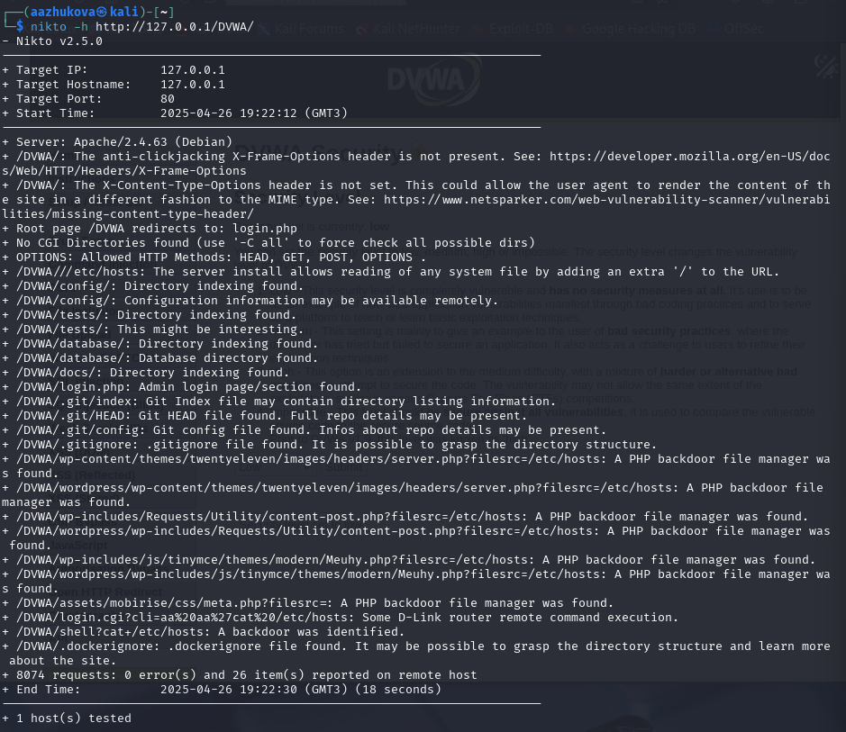
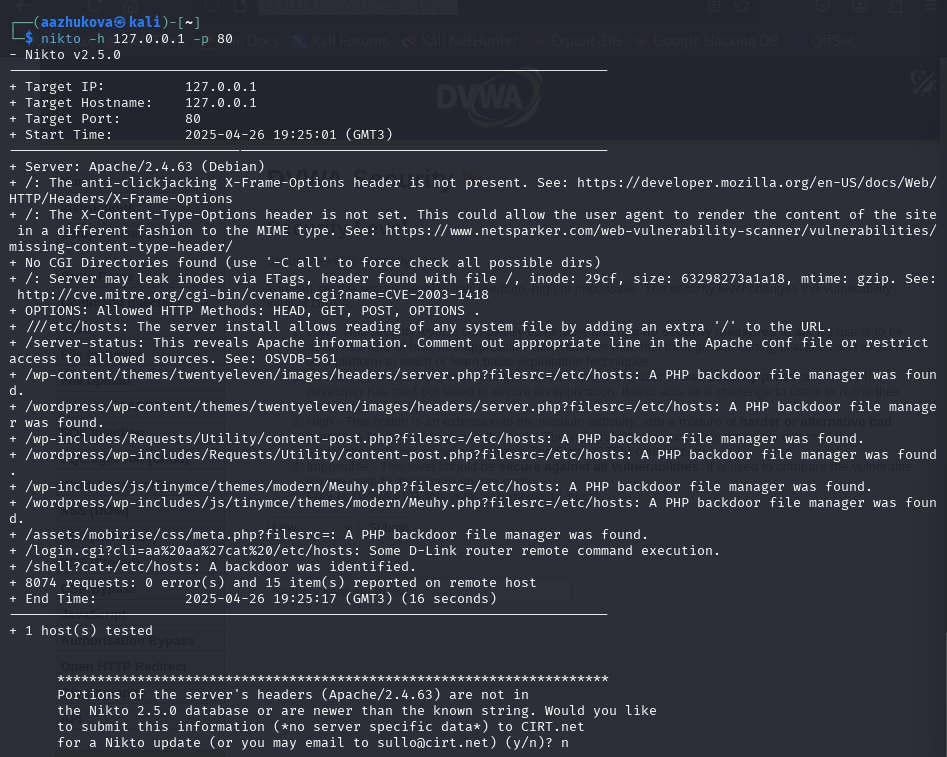

---
## Front matter
lang: ru-RU
title: Индивидуальный проект. Этап 4
subtitle: Использование nikto
author:
  - Жукова А. А.
institute:
  - Российский университет дружбы народов, Москва, Россия
date: 26 апреля 2025

## i18n babel
babel-lang: russian
babel-otherlangs: english

## Formatting pdf
toc: false
toc-title: Содержание
slide_level: 2
aspectratio: 169
section-titles: true
theme: metropolis
header-includes:
 - \metroset{progressbar=frametitle,sectionpage=progressbar,numbering=fraction}
---

# Информация

## Докладчик

:::::::::::::: {.columns align=center}
::: {.column width="70%"}

  * Жукова Арина Александровна
  * Студент бакалавриата, 2 курс
  * группа: НПИбд-03-23
  * Российский университет дружбы народов
  * [1132239120@rudn.ru](mailto:1132239120@rudn.ru)

:::
::: {.column width="30%"}

:::
::::::::::::::

# Вводная часть

## Цель 

Научиться выявлять возможные уязвимости в веб-серверах при помощи приложения nikto.

# Ход выполнения работы

## Запуск сервера

Запускаем сервер при помощи команд `systemctl start "то, что запускаем"`. 

## Запуск приложения

2. Через терминал запускаем приложение для сканирования nikto

## Запуск сканирования

3. Запускаем сканирование, указывая ссылку http

## Запуск сканирования

4. Запускаем сканирование, указывая ip-адрес и порт

## Параметры

Можем указывать различные параметры, в зависимости от требований:

1. -h	    Указывает целевой веб-сервер для сканирования. Например, -h example.com
2. -p	    Указывает порт, на котором работает веб-сервер. 
3. -ssl     Активирует сканирование через SSL/TLS. 
4. -id	    Указывает пользовательский User-Agent для передачи веб-серверу.  
5. -o       Указывает файл для сохранения результатов сканирования. 
6. -Plugins	Активирует определенные плагины для сканирования. Например, -Plugins auto,niktо 
7. -Tuning	    Указывает профиль настроек для сканирования. Например, -Tuning 3

# Вывод

## Вывод

В ходе выполнения данного этапа были приобретены практические навыки использования базового сканера безопасности веб-серверов nikto.

# Список литературы. Библиография

[1] Парасрам, Ш. Kali Linux: Тестирование на проникновение и безопасность : Для профессионалов. Kali Linux / Ш. Парасрам, А. Замм, Т. Хериянто, и др. – Санкт-Петербург : Питер, 2022. – 448 сс.
