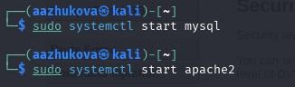

---
## Front matter
title: "Индивидуальный проект. Этап 4"
subtitle: "Испльзование nikto"
author: "Жукова Арина Александровна, НПИбд-03-23"

## Generic otions
lang: ru-RU
toc-title: "Содержание"

## Bibliography
bibliography: bib/cite.bib
csl: pandoc/csl/gost-r-7-0-5-2008-numeric.csl

## Pdf output format
toc: true # Table of contents
toc-depth: 2
lof: true # List of figures
lot: true # List of tables
fontsize: 12pt
linestretch: 1.5
papersize: a4
documentclass: scrreprt
## I18n polyglossia
polyglossia-lang:
  name: russian
  options:
	- spelling=modern
	- babelshorthands=true
polyglossia-otherlangs:
  name: english
## I18n babel
babel-lang: russian
babel-otherlangs: english
## Fonts
mainfont: IBM Plex Serif
romanfont: IBM Plex Serif
sansfont: IBM Plex Sans
monofont: IBM Plex Mono
mathfont: STIX Two Math
mainfontoptions: Ligatures=Common,Ligatures=TeX,Scale=0.94
romanfontoptions: Ligatures=Common,Ligatures=TeX,Scale=0.94
sansfontoptions: Ligatures=Common,Ligatures=TeX,Scale=MatchLowercase,Scale=0.94
monofontoptions: Scale=MatchLowercase,Scale=0.94,FakeStretch=0.9
mathfontoptions:
## Biblatex
biblatex: true
biblio-style: "gost-numeric"
biblatexoptions:
  - parentracker=true
  - backend=biber
  - hyperref=auto
  - language=auto
  - autolang=other*
  - citestyle=gost-numeric
## Pandoc-crossref LaTeX customization
figureTitle: "Рис."
tableTitle: "Таблица"
listingTitle: "Листинг"
lofTitle: "Список иллюстраций"
lotTitle: "Список таблиц"
lolTitle: "Листинги"
## Misc options
indent: true
header-includes:
  - \usepackage{indentfirst}
  - \usepackage{float} # keep figures where there are in the text
  - \floatplacement{figure}{H} # keep figures where there are in the text
---

# Цель работы

Научиться выявлять возможные уязвимости в веб-серверах при помощи nikto.

# Задание

Использовать nikto

# Теоретическое введение

 Nikto — базовый сканер безопасности веб-сервера. Он сканирует и обнаруживает уязвимости в веб-приложениях, вызванные неправильной конфигурацией, файлами по умолчанию, небезопасными файлами и устаревшими серверными приложениями. Поскольку nikto построен на LibWhisker2, он сразу после установки поддерживает кросс-платформенное развертывание, SSL (криптографический протокол для более безопасной связи), методы аутентификации хоста (NTLM/Basic), прокси и несколько методов уклонения от идентификаторов. Он также поддерживает перечисление под доменов, проверку безопасности приложений (XSS, SQL-инъекции и т.д.) и способен с помощью атаки паролей на основе словаря угадывать учетные данные авторизации.
 
# Выполнение работы

1. Запускаем сервер при помощи команд `systemctl start "то, что запускаем"`. 

{#fig:001 width=70%}

2. Через терминал запускаем приложение для сканирования nikto

{#fig:002 width=70%}

3. Запускаем сканирование, указывая ссылку http

{#fig:003 width=70%}

4. Запускаем сканирование, указывая ip-адрес и порт

{#fig:004 width=70%}

Можем указывать различные параметры, в зависимости от требований:

    -h	    Указывает целевой веб-сервер для сканирования. Например, -h example.com
    
    -p	    Указывает порт, на котором работает веб-сервер.
    
    -ssl	Активирует сканирование через SSL/TLS.
    
    -id	    Указывает пользовательский User-Agent для передачи веб-серверу.
    
    -o	    Указывает файл для сохранения результатов сканирования.
    
    -Plugins	Активирует определенные плагины для сканирования. Например, -Plugins auto,nikto
    
    -Tuning	    Указывает профиль настроек для сканирования. Например, -Tuning 3

# Выводы

В ходе выполнения данного этапа были приобретены практические навыки использования базового сканера безопасности веб-серверов nikto.

# Список литературы{.unnumbered}

1. Парасрам, Ш. Kali Linux: Тестирование на проникновение и безопасность : Для профессионалов. Kali Linux / Ш. Парасрам, А. Замм, Т. Хериянто, и др. – Санкт-Петербург : Питер, 2022. – 448 сс.

::: {#refs}
:::
